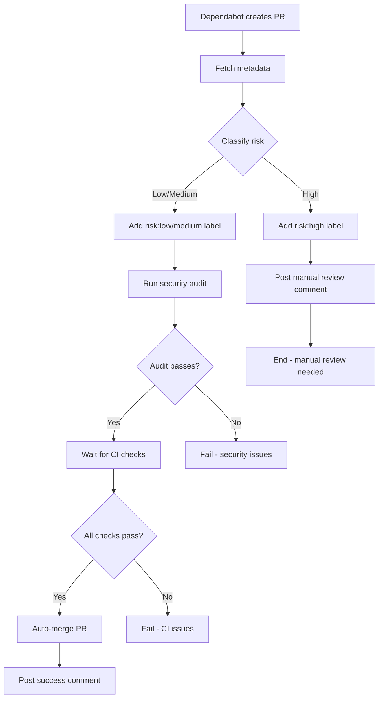

# Dependabot Auto-Merge Workflow

## Overview

This repository uses an automated workflow to review and merge Dependabot dependency updates with minimal manual intervention. The workflow automatically assesses risk, runs quality gates, and merges low-risk updates.

## How It Works

### Automatic Triggering

The workflow automatically runs when Dependabot creates or updates a pull request:
- **Triggers**: PR opened, synchronized, or reopened
- **Actor**: Only runs for `dependabot[bot]` PRs
- **Duration**: 5-30 minutes (waits for CI checks)

### Risk Classification

Every Dependabot PR is automatically classified into one of three risk levels:

#### 🟢 Low Risk - Auto-Merge ✅
- **Criteria**: Patch updates to dev dependencies (`1.2.3` → `1.2.4`)
- **Examples**:
  - `@types/node: 25.0.3 → 25.0.6`
  - `vitest: 4.0.16 → 4.0.17`
  - `typescript-eslint: 8.1.0 → 8.1.1`
- **Action**: Automatically merged after all checks pass

#### 🟡 Medium Risk - Auto-Merge with Tests ✅
- **Criteria**: Minor updates to dev dependencies (`1.2.3` → `1.3.0`)
- **Examples**:
  - `@types/node: 25.0.3 → 25.1.0`
  - `vitest: 4.0.16 → 4.1.0`
  - `eslint: 9.0.0 → 9.1.0`
- **Action**: Automatically merged after all checks pass

#### 🔴 High Risk - Manual Review Required ⚠️
- **Criteria**: 
  - Major version updates (`1.2.3` → `2.0.0`)
  - Production dependencies (any update)
  - Security-related updates requiring review
- **Examples**:
  - `@types/node: 25.0.3 → 26.0.0` (major)
  - `screeps-cartographer: 1.2.3 → 2.0.0` (production, major)
  - Any dependency with breaking changes
- **Action**: Requires manual review and approval

### Quality Gates

Before auto-merging, the workflow enforces these quality gates:

1. ✅ **All CI Checks Pass**
   - Main bot tests
   - Package tests (all 12 packages)
   - TypeScript compilation
   - Linting and formatting
   - Bundle size checks
   - MCP server tests
   - Exporter tests

2. ✅ **Security Audit Passes**
   - `npm audit --audit-level=moderate`
   - No new vulnerabilities introduced

3. ✅ **PR is Mergeable**
   - No merge conflicts
   - Branch is up to date
   - All required status checks complete

### Workflow Steps



## Labels

The workflow uses these labels to indicate risk level:

- `risk:low` (green) - Patch dev dependency updates
- `risk:medium` (yellow) - Minor dev dependency updates  
- `risk:high` (red) - Major updates or production dependencies
- `dependencies` - All Dependabot PRs
- `automated` - Automated PRs

## Usage

### Automatic Operation

No manual intervention is needed for low and medium risk updates. The workflow will:

1. Automatically classify the PR
2. Add appropriate risk labels
3. Post an assessment comment
4. Run quality gates
5. Wait for CI to complete
6. Auto-merge if all checks pass
7. Post a success/failure comment

### Manual Testing

To manually test the workflow on a specific PR:

```bash
# Trigger via GitHub Actions UI
1. Go to Actions → Auto-Merge Dependabot PRs
2. Click "Run workflow"
3. Enter the PR number
4. Click "Run workflow"
```

Or via GitHub CLI:

```bash
gh workflow run auto-merge-dependabot.yml -f pr_number=1234
```

### Monitoring Auto-Merge Activity

Check the workflow runs in the Actions tab:

```bash
gh run list --workflow=auto-merge-dependabot.yml --limit 20
```

View details of a specific run:

```bash
gh run view <run-id>
```

## Expected Behavior

### For Low/Medium Risk PRs

1. **PR Created**: Dependabot opens a PR
2. **Assessment** (30 seconds): Risk classification, labels added
3. **Quality Gates** (2-3 minutes): Security audit runs
4. **CI Checks** (5-10 minutes): Wait for all required checks
5. **Auto-Merge** (instant): PR merged automatically
6. **Total Time**: 5-15 minutes from PR creation to merge

### For High Risk PRs

1. **PR Created**: Dependabot opens a PR
2. **Assessment** (30 seconds): Risk classification, labels added
3. **Manual Review**: Comment posted explaining why manual review is needed
4. **Waiting**: PR remains open for human review
5. **Manual Merge**: Human reviews and merges when ready

## Troubleshooting

### Workflow Doesn't Run

**Problem**: Workflow doesn't trigger on Dependabot PR

**Solutions**:
- Verify the PR author is `dependabot[bot]`
- Check the workflow file is on the default branch
- Ensure the workflow has required permissions

### Auto-Merge Fails

**Problem**: Workflow classifies as low-risk but doesn't merge

**Common causes**:
1. **CI Checks Failed**: Check the CI tab for failures
2. **Security Audit Failed**: Check for new vulnerabilities with `npm audit`
3. **Merge Conflicts**: Rebase the PR on the base branch
4. **Branch Protection**: Verify branch protection allows auto-merge

**Debug steps**:
```bash
# Check workflow run logs
gh run view <run-id> --log

# Check PR status
gh pr view <pr-number> --json statusCheckRollup

# Check for merge conflicts
gh pr view <pr-number> --json mergeable
```

### Incorrect Risk Classification

**Problem**: Workflow classifies risk incorrectly

**Cause**: Usually due to Dependabot metadata format changes

**Solution**: Check the workflow logs for metadata structure and update the risk classification logic if needed

### Security Audit Fails

**Problem**: `npm audit` fails during auto-merge

**Cause**: New dependency introduces vulnerabilities

**Action**: This is working as intended! The workflow prevents merging vulnerable dependencies. Fix the vulnerabilities manually or wait for Dependabot to update to a patched version.

## Configuration

### Adjusting Risk Levels

To modify what gets auto-merged, edit `.github/workflows/auto-merge-dependabot.yml`:

```yaml
# Make major dev dependencies auto-merge (NOT RECOMMENDED)
else if (updateType === 'version-update:semver-major' && 
         dependencyType.includes('development')) {
  riskLevel = 'medium';
  autoMerge = true;  # Changed from false
  reason = 'Major update to dev dependency';
}
```

### Disabling Auto-Merge

To temporarily disable auto-merge without deleting the workflow:

**Option 1**: Add a condition to the job:
```yaml
if: github.actor == 'dependabot[bot]' && false  # Disabled
```

**Option 2**: Remove the workflow file:
```bash
git rm .github/workflows/auto-merge-dependabot.yml
```

**Option 3**: Use the general auto-merge workflow instead:
- Remove the Dependabot-specific workflow
- Use the `auto-merge-candidate` label on PRs you want to auto-merge

## Metrics and Monitoring

### Success Rate

Track auto-merge success rate:

```bash
# Count successful auto-merges
gh run list --workflow=auto-merge-dependabot.yml \
  --status=success --json conclusion \
  | jq '. | length'

# Count all runs
gh run list --workflow=auto-merge-dependabot.yml \
  --json conclusion | jq '. | length'
```

### Merge Time

Average time from PR creation to merge:

```bash
# Get PR details with merge times
gh pr list --state merged --label dependencies \
  --json number,createdAt,mergedAt \
  | jq '[.[] | {
      pr: .number,
      duration: (((.mergedAt | fromdateiso8601) - (.createdAt | fromdateiso8601)) / 60)
    }]'
```

### Recommended Monitoring

**Weekly Review**:
- [ ] Check for stale Dependabot PRs (>7 days old)
- [ ] Review high-risk PRs requiring manual merge
- [ ] Check auto-merge success rate (target: >80%)
- [ ] Review security audit failures

**Monthly Review**:
- [ ] Analyze average merge time (target: <30 minutes for low-risk)
- [ ] Review dependency update patterns
- [ ] Update risk classification rules if needed
- [ ] Check for workflow errors or timeouts

## Best Practices

### For Repository Maintainers

1. **Monitor Weekly**: Review Dependabot PR status weekly
2. **Address High-Risk PRs Promptly**: Don't let high-risk PRs accumulate
3. **Keep CI Fast**: Slow CI increases auto-merge time
4. **Update Risk Rules Carefully**: Test changes to risk classification
5. **Review Metrics**: Track auto-merge success and adjust as needed

### For Contributors

1. **Trust the System**: Low-risk updates are safe to auto-merge
2. **Review High-Risk PRs**: Check changelog for breaking changes
3. **Test Major Updates**: Create a test branch for major dependency updates
4. **Report Issues**: If auto-merge behaves unexpectedly, create an issue

## Future Enhancements

Potential improvements to consider:

- [ ] **Dashboard Integration**: Grafana dashboard for dependency health metrics
- [ ] **Slack/Discord Notifications**: Alert on high-risk updates or failures
- [ ] **Bundle Size Impact**: Fail auto-merge if bundle size increases significantly
- [ ] **Changelog Parsing**: Detect breaking changes in release notes
- [ ] **Rollback Support**: Automatically revert if deployment metrics degrade
- [ ] **Dependency Grouping**: Auto-merge related dependencies together
- [ ] **Custom Rules**: Per-dependency auto-merge policies

## Related Documentation

- [WORKFLOWS.md](WORKFLOWS.md) - Complete workflow documentation
- [BRANCH_PROTECTION.md](BRANCH_PROTECTION.md) - Branch protection rules
- [CONTRIBUTING.md](CONTRIBUTING.md) - Contribution guidelines
- [GitHub Dependabot Documentation](https://docs.github.com/en/code-security/dependabot)

## Support

If you encounter issues with the auto-merge workflow:

1. Check this documentation first
2. Review the [Troubleshooting](#troubleshooting) section
3. Check workflow run logs in the Actions tab
4. Create an issue with the `automation` and `ci` labels

---

*Last Updated: 2026-01-15 - Initial implementation*
