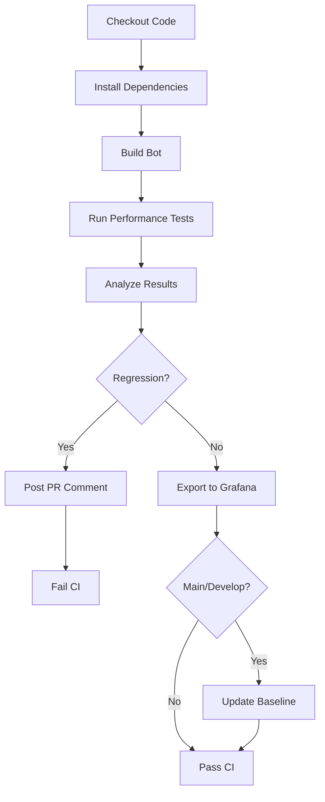

# Performance Testing Guide

This guide explains how to run performance tests locally and in CI, analyze results, and manage performance baselines.

## Table of Contents

1. [Overview](#overview)
2. [Running Performance Tests Locally](#running-performance-tests-locally)
3. [Understanding Test Results](#understanding-test-results)
4. [Baseline Management](#baseline-management)
5. [Expanded Metrics Tracking](#expanded-metrics-tracking)
6. [CI Integration](#ci-integration)
7. [Grafana Integration](#grafana-integration)
8. [Troubleshooting](#troubleshooting)

## Overview

The performance testing infrastructure includes:

- **Automated CPU and memory tracking** - Monitors resource usage during bot execution
- **Baseline comparison** - Compares current performance against established baselines
- **Regression detection** - Fails CI if performance degrades beyond thresholds
- **PR comments** - Posts performance summaries on pull requests
- **Grafana export** - Sends metrics to monitoring dashboards
- **Historical tracking** - Archives baseline snapshots over time

### Performance Targets (from ROADMAP.md)

- **Eco room**: ≤0.1 CPU per tick
- **Combat room**: ≤0.25 CPU per tick
- **Global kernel**: ≤1 CPU every 20-50 ticks
- **Scale**: Support 100+ rooms, 5000+ creeps

### Regression Thresholds

- **CPU regression**: >10% increase triggers failure
- **Memory regression**: >10% increase triggers warning
- **Bucket stability**: Minimum 5000 (warning), target 9000+

## Running Performance Tests Locally

### Prerequisites

- Node.js 16+ (as specified in `.nvmrc`)
- Docker Desktop (for screeps-performance-server)
- npm dependencies installed

### Quick Start

```bash
# Install dependencies
npm ci

# Build the bot code
npm run build

# Run performance tests with logs
cd packages/screeps-bot
npm run test:performance:logs
```

### Available Test Commands

```bash
# Basic performance test (no logs)
npm run test:performance

# Performance test with detailed logging
npm run test:performance:logs

# Integration test (includes performance aspects)
npm run test:integration

# Unit tests for performance analysis logic
npm test -- test/unit/performanceAnalysis.test.ts
```

### Test Configuration

Performance tests accept these parameters:

```bash
# Run with custom tick count and duration
npm run test:performance:logs -- \
  --maxTickCount=5000 \
  --maxTimeDuration=15 \
  --serverPort=21025 \
  --cliPort=21026
```

**Parameters:**
- `maxTickCount`: Maximum game ticks to run (default: 10000)
- `maxTimeDuration`: Maximum duration in minutes (default: 30)
- `serverPort`: Server port (default: 21025)
- `cliPort`: CLI port (default: 21026)
- `--deleteLogs`: Delete previous logs before running
- `--force`: Force restart server

## Understanding Test Results

### Console Output

Performance tests produce detailed console output:

```
=== Performance Analysis ===

Reading console logs...
Parsing CPU and memory metrics...
Found 1000 CPU samples
Found 1000 bucket samples
Found 1000 memory samples

CPU Statistics:
  Average: 5.655
  Maximum: 18.880
  P95:     15.447
  P99:     17.729

Memory Statistics:
  Average: 146.48 KB
  Maximum: 200.00 KB
  P95:     180.50 KB

Bucket Statistics:
  Average: 9500
  Minimum: 9000
  Maximum: 10000

Loading baseline...
Comparing against baseline for branch: main
✅ No performance regression detected
```

### Report Files

Tests generate several output files:

#### `performance-results.json`
Raw results from the performance server:
```json
{
  "milestones": [
    { "name": "RCL 4 reached", "achieved": true }
  ]
}
```

#### `performance-report.json`
Comprehensive analysis report:
```json
{
  "timestamp": "2026-01-07T00:00:00Z",
  "commit": "abc123",
  "branch": "main",
  "passed": true,
  "analysis": {
    "cpu": {
      "avg": 5.655,
      "max": 18.88,
      "p95": 15.447,
      "p99": 17.729,
      "sampleCount": 1000
    },
    "bucket": {
      "avg": 9500,
      "min": 9000,
      "max": 10000,
      "sampleCount": 1000
    },
    "memory": {
      "avg": 150000,
      "max": 200000,
      "p95": 180000,
      "sampleCount": 1000
    }
  },
  "regression": {
    "detected": false,
    "avgCpuChange": -2.5,
    "maxCpuChange": 1.2,
    "avgMemoryChange": 0.0,
    "avgRegression": false,
    "maxRegression": false,
    "memoryRegression": false
  },
  "summary": {
    "avgCpu": "5.655",
    "maxCpu": "18.880",
    "p95Cpu": "15.447",
    "avgMemory": "146.48 KB",
    "maxMemory": "195.31 KB",
    "avgBucket": "9500",
    "minBucket": "9000",
    "sampleCount": 1000
  }
}
```

#### `performance-report.md`
Markdown summary for PR comments:
```markdown
## 📊 Performance Test Results

### Summary

| Metric | Value | Status |
|--------|-------|--------|
| Avg CPU | 5.655 | ✅ |
| Max CPU | 18.880 | ✅ |
| P95 CPU | 15.447 | ℹ️ |
| P99 CPU | 17.729 | ℹ️ |
| Avg Memory | 146.48 KB | ✅ |
| Max Memory | 195.31 KB | ℹ️ |
| Avg Bucket | 9500 | ✅ |
| Min Bucket | 9000 | ✅ |
| Samples | 1000 | ℹ️ |

### ✅ No Performance Regression

Performance is within acceptable limits compared to baseline.
```

### Interpreting Results

**Status Icons:**
- ✅ **Pass** - Metric meets target or shows no regression
- ⚠️ **Warning** - Metric close to threshold (5-10% increase)
- ❌ **Fail** - Metric exceeds regression threshold (>10% increase)
- ℹ️ **Info** - Metric tracked but not enforced

**Key Metrics:**
- **Avg CPU** - Average CPU usage per tick (target: ≤0.1 for eco, ≤0.25 for combat)
- **Max CPU** - Peak CPU usage (should not exceed bucket generation rate)
- **P95/P99 CPU** - 95th/99th percentile (identifies outliers)
- **Avg/Max Memory** - Memory footprint in bytes (monitor growth over time)
- **Avg/Min Bucket** - CPU bucket level (target: >9000 avg, >5000 min)

## Baseline Management

### Baseline Structure

Baselines are stored in `performance-baselines/`:

```
performance-baselines/
├── README.md           # Documentation
├── main.json          # Production baseline
├── develop.json       # Development baseline
└── history/           # Historical snapshots
    ├── 2026-01-07_main_abc123.json
    └── 2026-01-06_main_def456.json
```

### Baseline Format

```json
{
  "commit": "abc123",
  "timestamp": "2026-01-07T00:00:00Z",
  "branch": "main",
  "scenarios": {
    "default": {
      "avgCpu": 5.655,
      "maxCpu": 18.88,
      "p95Cpu": 15.447,
      "p99Cpu": 17.729,
      "avgMemory": 150000,
      "maxMemory": 200000,
      "p95Memory": 180000
    }
  },
  "cpu": {
    "avg": 5.655,
    "p95": 15.447,
    "max": 18.88,
    "bucket": 9500
  },
  "gcl": {
    "progressPerTick": 0.012,
    "level": 15,
    "progress": 45000
  },
  "energy": {
    "incomePerTick": 150
  },
  "rooms": {
    "W1N1": {
      "rcl": 8,
      "cpu": {
        "avg": 0.08,
        "p95": 0.12,
        "max": 0.15
      },
      "creepCount": 25,
      "energy": {
        "income": 150,
        "expenses": 120
      }
    }
  },
  "kernel": {
    "processes": {
      "spawn": {
        "cpu": 0.15,
        "frequency": "high"
      },
      "defense": {
        "cpu": 0.05,
        "frequency": "high"
      }
    },
    "totalBudget": 1.0,
    "actualUsage": 0.85
  },
  "cache": {
    "roomFind": {
      "hitRate": 0.95,
      "evictions": 12
    },
    "pathCache": {
      "hitRate": 0.88
    },
    "objectCache": {
      "hitRate": 0.92,
      "size": 1500
    },
    "global": {
      "hitRate": 0.93,
      "totalHits": 5000,
      "totalMisses": 350
    }
  },
  "creeps": {
    "byRole": {
      "harvester": 15,
      "upgrader": 8,
      "builder": 3,
      "carrier": 12
    },
    "total": 38,
    "idle": 2
  },
  "memory": {
    "used": 150000,
    "limit": 2097152,
    "usagePercent": 7.15
  }
}
```

### Updating Baselines

#### Automatic Updates

Baselines are automatically updated when:
1. Performance tests **pass** without regression
2. Changes are merged to `main` or `develop` branches
3. CI workflow completes successfully

#### Manual Updates

To manually update a baseline:

```bash
# Run performance tests
npm run test:performance:logs

# Analyze results
node scripts/analyze-performance.js

# Update baseline (only if tests passed)
node scripts/update-baseline.js [branch-name]

# Commit the updated baseline
git add performance-baselines/
git commit -m "chore(performance): update baseline for [branch]"
```

#### Baseline Update Workflow

GitHub Actions workflow for manual baseline updates:

```yaml
# Trigger: Manual workflow_dispatch
# Location: .github/workflows/performance-test.yml
# Action: Update performance baseline
```

To trigger:
1. Go to Actions tab in GitHub
2. Select "Performance Tests" workflow
3. Click "Run workflow"
4. Select branch
5. Confirm baseline update

### Historical Snapshots

Every baseline update creates a historical snapshot:

```
history/2026-01-07_main_abc123.json
```

**Format:** `YYYY-MM-DD_[branch]_[commit-short].json`

**Retention:** Indefinite (committed to git)

**Use cases:**
- Compare performance trends over time
- Investigate when regressions were introduced
- Validate optimization impact

## CI Integration

### Workflow Triggers

Performance tests run automatically on:

1. **Pull Requests** - Changes to bot code or performance tests
2. **Main/Develop Pushes** - After merge to protected branches
3. **Manual Trigger** - Workflow dispatch with custom parameters

### Workflow Steps



### PR Comments

Performance tests post detailed comments on pull requests:

**Example Comment:**

```markdown
## 📊 Performance Test Results

### Summary
[Performance metrics table]

### ⚠️ Performance Regression Detected
[Regression details if applicable]

### 🎯 Milestones
[Test milestones achieved]
```

### CI Failure Conditions

CI fails if:
- ❌ Avg CPU increases >10%
- ❌ Max CPU increases >10%
- ❌ Memory increases >10%
- ❌ Performance tests crash or timeout

CI warnings (non-failing):
- ⚠️ Bucket drops below 5000
- ⚠️ CPU/memory increases 5-10%

## Grafana Integration

### Exporting Metrics

Performance metrics can be exported to Grafana:

```bash
# Export to Prometheus Pushgateway
METRICS_FORMAT=prometheus \
PROMETHEUS_PUSHGATEWAY_URL=http://localhost:9091 \
node scripts/export-to-grafana.js

# Export to Graphite
METRICS_FORMAT=graphite \
GRAPHITE_HOST=localhost \
GRAPHITE_PORT=2003 \
node scripts/export-to-grafana.js
```

### Metrics Exported

**Prometheus format:**
```
screeps_performance_avg_cpu{branch="main",commit="abc123"} 5.655 1704672000000
screeps_performance_max_cpu{branch="main",commit="abc123"} 18.88 1704672000000
screeps_performance_p95_cpu{branch="main",commit="abc123"} 15.447 1704672000000
screeps_performance_avg_memory_bytes{branch="main",commit="abc123"} 150000 1704672000000
screeps_performance_regression{branch="main",commit="abc123"} 0 1704672000000
screeps_performance_cpu_change_percent{branch="main",commit="abc123"} -2.5 1704672000000
```

**Graphite format:**
```
screeps.performance.main.cpu.avg 5.655 1704672000
screeps.performance.main.cpu.max 18.88 1704672000
screeps.performance.main.memory.avg 150000 1704672000
screeps.performance.main.regression 0 1704672000
```

### CI Configuration

Set these secrets in GitHub repository settings:

- `METRICS_FORMAT` - `prometheus` or `graphite` (default: `prometheus`)
- `PROMETHEUS_PUSHGATEWAY_URL` - Prometheus Pushgateway URL
- `GRAPHITE_HOST` - Graphite server hostname
- `GRAPHITE_PORT` - Graphite server port (default: 2003)

### Dashboard Setup

Use the grafana-mcp tools to create dashboards:

```typescript
// Example: Create performance dashboard
await create_dashboard({
  title: "Performance Test Trends",
  panels: [
    { metric: "screeps_performance_avg_cpu", title: "Average CPU Usage" },
    { metric: "screeps_performance_avg_memory_bytes", title: "Memory Usage" },
    { metric: "screeps_performance_regression", title: "Regression Status" }
  ]
});
```

## Troubleshooting

### Common Issues

#### No CPU metrics found in logs

**Symptom:** "Warning: No CPU metrics found in logs"

**Cause:** Bot not logging CPU usage in expected format

**Solution:**
1. Ensure bot logs include CPU metrics: `CPU: X.XX Bucket: XXXX`
2. Or use JSON stats format: `{"type":"stats","data":{"cpu":{"used":X.XX}}}`
3. Check `logs/console.log` for actual output format

#### Performance tests timeout

**Symptom:** Tests exceed `maxTimeDuration`

**Cause:** Bot stuck or inefficient code

**Solution:**
1. Reduce `maxTickCount` for faster tests
2. Check bot code for infinite loops or blocking operations
3. Review server logs for errors

#### Baseline not updating

**Symptom:** Baseline file unchanged after test

**Cause:** Tests failed or not on main/develop branch

**Solution:**
1. Check that `performance-report.json` has `"passed": true`
2. Verify no regression detected
3. Ensure running on `main` or `develop` branch
4. Check workflow permissions (needs `contents: write`)

#### Memory metrics missing

**Symptom:** No memory statistics in report

**Cause:** Bot not logging memory usage

**Solution:**
1. Add memory logging to bot: `Memory: XXX KB`
2. Or use JSON format: `{"type":"stats","data":{"memory":{"used":XXXXX}}}`
3. Memory tracking is optional - tests pass without it

### Debug Mode

Enable verbose logging:

```bash
# Run with debug output
DEBUG=* npm run test:performance:logs

# Check server logs
tail -f packages/screeps-bot/logs/console.log
tail -f packages/screeps-bot/logs/server.log
```

### Resetting Baselines

To reset baselines to ROADMAP targets:

```bash
# Backup current baselines
cp performance-baselines/main.json performance-baselines/main.json.backup

# Restore from develop.json (has ROADMAP targets)
cp performance-baselines/develop.json performance-baselines/main.json
```

## Expanded Metrics Tracking

The performance baseline system now tracks comprehensive metrics beyond basic CPU and memory:

### Per-Room CPU Breakdown

Track CPU usage on a per-room basis to identify expensive rooms:

```json
"rooms": {
  "W1N1": {
    "rcl": 8,
    "cpu": {
      "avg": 0.08,    // Average CPU per tick
      "p95": 0.12,    // 95th percentile
      "max": 0.15     // Peak usage
    },
    "creepCount": 25,
    "energy": {
      "income": 150,    // Energy harvested per tick
      "expenses": 120   // Energy spent per tick
    }
  }
}
```

**Use Cases:**
- Identify rooms exceeding the 0.1 CPU target
- Prioritize optimization efforts on highest-CPU rooms
- Track scaling efficiency as rooms are added

### Kernel Process CPU Allocation

Monitor CPU usage by kernel processes to identify bottlenecks:

```json
"kernel": {
  "processes": {
    "spawn": {
      "cpu": 0.15,
      "frequency": "high"  // Runs every tick
    },
    "defense": {
      "cpu": 0.05,
      "frequency": "high"
    },
    "expansion": {
      "cpu": 0.20,
      "frequency": "low"   // Runs every 50 ticks
    }
  },
  "totalBudget": 1.0,
  "actualUsage": 0.85
}
```

**Use Cases:**
- Validate kernel budget allocation (target: ≤1 CPU amortized)
- Identify processes exceeding their budget
- Optimize high-frequency processes first

### Cache Performance Metrics

Track cache hit rates to validate caching effectiveness:

```json
"cache": {
  "roomFind": {
    "hitRate": 0.95,     // 95% cache hits
    "evictions": 12
  },
  "pathCache": {
    "hitRate": 0.88
  },
  "objectCache": {
    "hitRate": 0.92,
    "size": 1500
  },
  "global": {
    "hitRate": 0.93,
    "totalHits": 5000,
    "totalMisses": 350
  }
}
```

**Use Cases:**
- Validate cache effectiveness (target: >90% hit rate)
- Identify cache thrashing or undersized caches
- Measure impact of cache optimizations

### Creep Role Distribution

Track creep population by role:

```json
"creeps": {
  "byRole": {
    "harvester": 15,
    "upgrader": 8,
    "builder": 3,
    "carrier": 12
  },
  "total": 38,
  "idle": 2
}
```

**Use Cases:**
- Detect spawn queue imbalances
- Identify idle creeps indicating logic issues
- Validate role distribution matches strategy

### Memory Usage

Track memory footprint and usage:

```json
"memory": {
  "used": 150000,      // Bytes used
  "limit": 2097152,    // Byte limit
  "usagePercent": 7.15 // Percentage
}
```

**Use Cases:**
- Monitor memory growth over time
- Detect memory leaks
- Ensure headroom for scaling

### Viewing Expanded Metrics

Expanded metrics are automatically collected when the bot logs stats in JSON format:

```javascript
// In bot code (already implemented via unifiedStats)
console.log(JSON.stringify({
  type: "stats",
  tick: Game.time,
  data: {
    cpu: { used: Game.cpu.getUsed() },
    rooms: { /* room data */ },
    processes: { /* kernel data */ },
    cache: { /* cache stats */ }
  }
}));
```

The analyze-performance.js script automatically parses these logs and includes the metrics in baselines.

### Weekly Baseline Updates

A GitHub Actions workflow runs weekly to update baselines with fresh data:

```yaml
# .github/workflows/update-baselines.yml
# Runs: Sunday at midnight UTC
# Action: Updates main.json and develop.json with latest performance data
```

**Process:**
1. Runs full performance test suite
2. Analyzes results with expanded metrics
3. Archives current baseline to history/
4. Updates baseline if tests pass without regression
5. Commits changes to repository

**Manual Trigger:**
```bash
# Via GitHub UI: Actions > Update Performance Baselines > Run workflow
```

### Getting Help

1. Check existing test runs in GitHub Actions
2. Review historical baselines in `performance-baselines/history/`
3. Compare with successful test runs on main branch
4. Open an issue with:
   - Test command used
   - Full console output
   - `performance-report.json` contents
   - Server logs (if available)

## Best Practices

### For Developers

1. **Run tests locally** before pushing to verify no regressions
2. **Check PR comments** for performance impact
3. **Investigate warnings** even if CI passes
4. **Monitor trends** over time using historical data

### For Reviewers

1. **Review performance reports** in PR comments
2. **Question regressions** even if below threshold
3. **Approve baseline updates** only for legitimate improvements
4. **Check for trade-offs** (CPU vs memory, etc.)

### For Optimizations

1. **Establish baseline** before optimization work
2. **Measure impact** with performance tests
3. **Document improvements** in PR description
4. **Update baselines** after merge to main

---

**Last Updated:** 2026-01-07  
**Maintainer:** Screeps Bot Development Team
