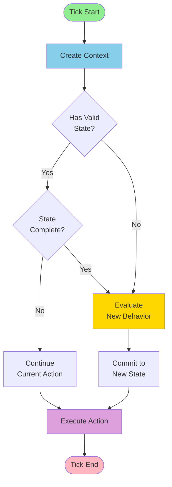
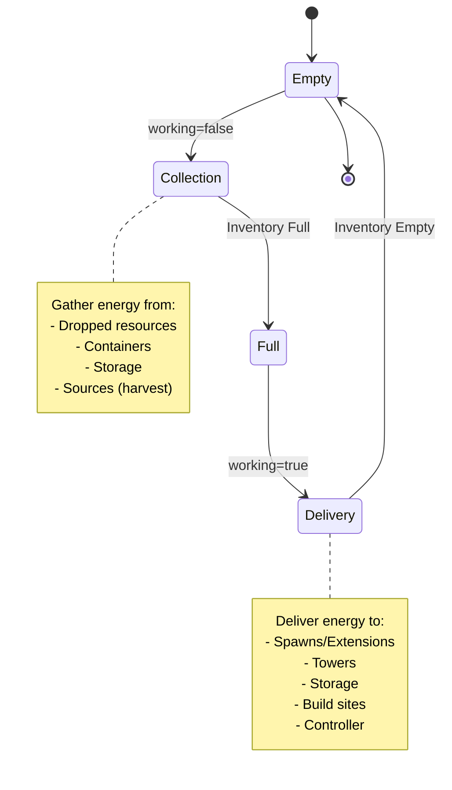

# Creep State Machine Documentation

This documentation provides visual representations of all creep state machines in the Screeps bot.

## Overview

The bot uses a state machine architecture for creep behavior:

1. **Context** - Gathers information about the creep's situation
2. **Behavior** - Evaluates the context and decides on an action
3. **State Machine** - Persists the action choice and prevents premature state changes
4. **Executor** - Executes the chosen action on the creep

## State Completion Logic

States complete based on inventory and target status:

- **Collection states** (harvest, withdraw, pickup): Complete when creep is full or target destroyed
- **Delivery states** (transfer, build, repair, upgrade): Complete when creep is empty or target full/destroyed
- **Movement states**: Complete when creep reaches destination
- **Idle state**: Always completes immediately

## Working State Pattern

Many economy roles use a "working" boolean flag pattern:

## Role Categories

### Economy Roles
- [LarvaWorker](state-machines/economy/larvaworker.md) - General purpose starter creep
- [Harvester](state-machines/economy/harvester.md) - Stationary source miner
- [Hauler](state-machines/economy/hauler.md) - Energy transport specialist
- [Builder](state-machines/economy/builder.md) - Construction specialist
- [Upgrader](state-machines/economy/upgrader.md) - Controller upgrade specialist
- [QueenCarrier](state-machines/economy/queencarrier.md) - Priority distributor
- [MineralHarvester](state-machines/economy/mineralharvester.md) - Mineral extraction
- [DepositHarvester](state-machines/economy/depositharvester.md) - Deposit harvesting
- [LabTech](state-machines/economy/labtech.md) - Lab logistics
- [FactoryWorker](state-machines/economy/factoryworker.md) - Factory operations
- [RemoteHarvester](state-machines/economy/remoteharvester.md) - Remote source mining
- [RemoteHauler](state-machines/economy/remotehauler.md) - Remote energy transport
- [InterRoomCarrier](state-machines/economy/interroomcarrier.md) - Inter-room logistics

### Military Roles
- [Guard](state-machines/military/guard.md) - Room defense
- [RemoteGuard](state-machines/military/remoteguard.md) - Remote room defense
- [Healer](state-machines/military/healer.md) - Combat healing
- [Soldier](state-machines/military/soldier.md) - Offensive combat
- [Siege](state-machines/military/siege.md) - Structure destruction
- [Harasser](state-machines/military/harasser.md) - Early aggression
- [Ranger](state-machines/military/ranger.md) - Ranged combat

### Utility Roles
- [Scout](state-machines/utility/scout.md) - Room exploration
- [Claimer](state-machines/utility/claimer.md) - Controller claiming/reserving
- [Engineer](state-machines/utility/engineer.md) - Repairs and maintenance
- [RemoteWorker](state-machines/utility/remoteworker.md) - Remote room support
- [LinkManager](state-machines/utility/linkmanager.md) - Link logistics
- [TerminalManager](state-machines/utility/terminalmanager.md) - Terminal operations

## Action Types

The state machine supports these action types:

**Resource Gathering:**
- `harvest` - Harvest from source
- `harvestMineral` - Harvest from mineral
- `harvestDeposit` - Harvest from deposit
- `pickup` - Pick up dropped resource
- `withdraw` - Withdraw from structure

**Resource Delivery:**
- `transfer` - Transfer to structure
- `drop` - Drop resource

**Construction:**
- `build` - Build construction site
- `repair` - Repair structure
- `upgrade` - Upgrade controller
- `dismantle` - Dismantle structure

**Combat:**
- `attack` - Melee attack
- `rangedAttack` - Ranged attack
- `heal` - Heal friendly creep
- `rangedHeal` - Ranged heal

**Controller:**
- `claim` - Claim controller
- `reserve` - Reserve controller
- `attackController` - Attack controller

**Movement:**
- `moveTo` - Move to target
- `moveToRoom` - Move to room
- `flee` - Flee from position
- `wait` - Wait at position

**Other:**
- `idle` - Do nothing
