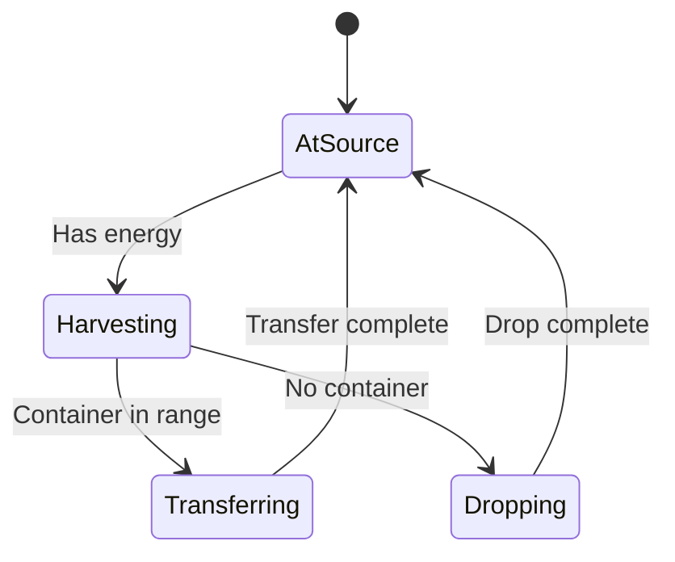
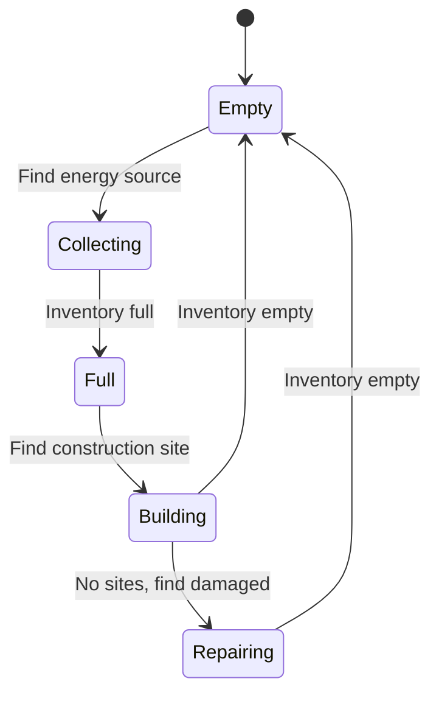
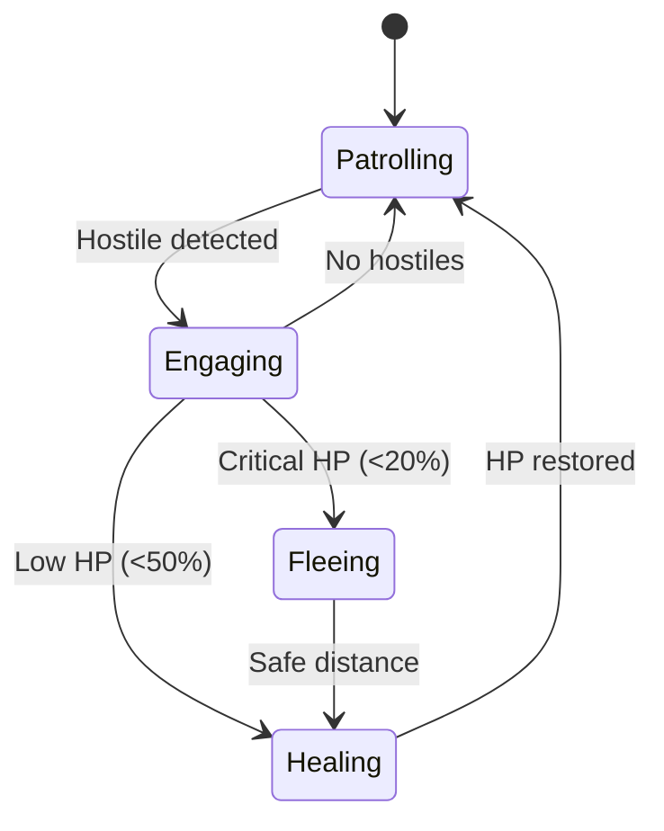

# State Machines Developer Guide

## Overview

State machines control creep behavior by persisting actions across ticks, preventing "action thrashing" where creeps change their mind every tick. This guide consolidates information from docs/STATE_MACHINES.md and docs/state-machines/ directory.

**Key Benefits:**
- **Action Persistence**: Creeps complete started actions
- **CPU Efficiency**: No re-evaluation every tick
- **Predictable Behavior**: Clear state transitions
- **Easy Debugging**: Visual state representations

## Table of Contents

1. [Architecture](#architecture)
2. [State Lifecycle](#state-lifecycle)
3. [Action Types](#action-types)
4. [Creating State Machines](#creating-state-machines)
5. [Common Patterns](#common-patterns)
6. [Role State Machines](#role-state-machines)
7. [Behavior Trees](#behavior-trees)
8. [Troubleshooting](#troubleshooting)

---

## Architecture

### Flow Diagram

```
Tick Start
    │
    ▼
┌─────────────────┐
│ Create Context  │ ← Gather creep state, nearby objects
└────────┬────────┘
         │
         ▼
┌─────────────────┐
│  Has Valid      │
│  State?         │
└────────┬────────┘
         │
    ┌────┴────┐
    │         │
   Yes       No
    │         │
    │         ▼
    │    ┌─────────────┐
    │    │  Evaluate   │ ← Run behavior function
    │    │  Behavior   │
    │    └─────┬───────┘
    │          │
    │          ▼
    │    ┌─────────────┐
    │    │  Commit to  │ ← Create new state
    │    │  New State  │
    │    └─────┬───────┘
    │          │
    └──────────┘
         │
         ▼
┌─────────────────┐
│  State          │
│  Complete?      │
└────────┬────────┘
         │
    ┌────┴────┐
    │         │
   Yes       No
    │         │
    │         ▼
    │    ┌─────────────┐
    │    │  Continue   │ ← Execute current state
    │    │  Action     │
    │    └─────────────┘
    │         
    ▼         
┌─────────────────┐
│  Clear State &  │
│  Re-evaluate    │
└─────────────────┘
```

### Components

**1. Behavior Function**: Evaluates context and returns desired action
**2. State Machine**: Stores action in `creep.memory._state`
**3. Completion Check**: Determines if action is finished
**4. Executor**: Performs the action on the creep

### Memory Structure

```typescript
interface CreepMemory {
  role: string;
  homeRoom: string;
  working?: boolean;
  _state?: {
    type: string;           // Action type (harvest, transfer, etc.)
    targetId?: Id<any>;     // Target object ID
    targetPos?: RoomPosition; // Target position
    startTick: number;      // When state began
    resourceType?: ResourceConstant; // For resource operations
  };
}
```

---

## State Lifecycle

### State Creation

```typescript
// Behavior decides action
export function harvesterBehavior(ctx: BehaviorContext): BehaviorAction {
  if (ctx.isEmpty) {
    const source = ctx.findClosest(ctx.sources);
    return { type: "harvest", target: source }; // New action
  }
  // ... deliver logic
}

// State machine commits action
if (!creep.memory._state || stateComplete(creep, creep.memory._state)) {
  const action = roleBehavior(context);
  creep.memory._state = {
    type: action.type,
    targetId: action.target?.id,
    startTick: Game.time
  };
}
```

### State Persistence

```typescript
// Action continues across ticks
Tick 100: Decide to harvest Source1 → State created
Tick 101: State exists → Continue harvesting Source1
Tick 102: State exists → Continue harvesting Source1
...
Tick 110: Creep full → State completes → Re-evaluate
```

### State Completion

Different actions complete under different conditions:

```typescript
function stateComplete(creep: Creep, state: CreepState): boolean {
  switch (state.type) {
    // Collection: Full or target gone
    case "harvest":
    case "withdraw":
    case "pickup":
      return creep.store.getFreeCapacity() === 0 || 
             !Game.getObjectById(state.targetId);
    
    // Delivery: Empty or target full/gone
    case "transfer":
    case "build":
    case "repair":
    case "upgrade":
      return creep.store.getUsedCapacity() === 0 ||
             !Game.getObjectById(state.targetId);
    
    // Movement: In range of target
    case "moveTo":
      const target = Game.getObjectById(state.targetId);
      return !target || creep.pos.isNearTo(target);
    
    // Always completes
    case "idle":
      return true;
      
    default:
      return false;
  }
}
```

### Forcing State Changes

Override state for emergencies:

```typescript
export function workerBehavior(ctx: BehaviorContext): BehaviorAction {
  // ALWAYS flee if threatened (ignore current state)
  if (ctx.nearbyEnemies) {
    delete ctx.creep.memory._state; // Clear state
    return { type: "flee", from: ctx.hostiles.map(h => h.pos) };
  }
  
  // Normal behavior...
}
```

---

## Action Types

### Resource Gathering

```typescript
// Harvest from source
{ type: "harvest", target: source }

// Harvest mineral
{ type: "harvestMineral", target: mineral }

// Pickup dropped resource
{ type: "pickup", target: resource }

// Withdraw from structure
{ type: "withdraw", target: storage, resourceType: RESOURCE_ENERGY }
```

### Resource Delivery

```typescript
// Transfer to structure/creep
{ type: "transfer", target: spawn, resourceType: RESOURCE_ENERGY }

// Drop resource
{ type: "drop", resourceType: RESOURCE_ENERGY, amount: 50 }
```

### Construction

```typescript
// Build construction site
{ type: "build", target: constructionSite }

// Repair structure
{ type: "repair", target: structure }

// Upgrade controller
{ type: "upgrade", target: controller }

// Dismantle structure
{ type: "dismantle", target: structure }
```

### Combat

```typescript
// Melee attack
{ type: "attack", target: hostile }

// Ranged attack
{ type: "rangedAttack", target: hostile }

// Heal friendly creep
{ type: "heal", target: damagedCreep }

// Ranged heal
{ type: "rangedHeal", target: damagedCreep }
```

### Controller Operations

```typescript
// Claim controller
{ type: "claim", target: controller }

// Reserve controller
{ type: "reserve", target: controller }

// Attack controller
{ type: "attackController", target: controller }
```

### Movement

```typescript
// Move to target
{ type: "moveTo", target: target }

// Move to room
{ type: "moveToRoom", roomName: "W1N1" }

// Flee from positions
{ type: "flee", from: [pos1, pos2] }

// Wait at position
{ type: "wait" }
```

### Special

```typescript
// Do nothing
{ type: "idle" }
```

---

## Creating State Machines

### Step 1: Define States

```typescript
type WorkerState = 
  | "collecting"
  | "delivering"
  | "idle";

interface WorkerMemory extends CreepMemory {
  state: WorkerState;
  working: boolean;
}
```

### Step 2: Create Behavior Function

```typescript
export function workerBehavior(ctx: BehaviorContext): BehaviorAction {
  const creep = ctx.creep;
  const memory = creep.memory as WorkerMemory;
  
  // State transitions
  if (!memory.working && ctx.isFull) {
    memory.working = true;
    memory.state = "delivering";
  }
  if (memory.working && ctx.isEmpty) {
    memory.working = false;
    memory.state = "collecting";
  }
  
  // Execute state
  switch (memory.state) {
    case "collecting":
      return collectEnergy(ctx);
    
    case "delivering":
      return deliverEnergy(ctx);
    
    default:
      memory.state = "idle";
      return { type: "idle" };
  }
}
```

### Step 3: Implement State Actions

```typescript
function collectEnergy(ctx: BehaviorContext): BehaviorAction {
  // Priority 1: Dropped resources
  if (ctx.droppedResources.length > 0) {
    const closest = ctx.findClosest(ctx.droppedResources);
    return { type: "pickup", target: closest };
  }
  
  // Priority 2: Containers
  const containers = ctx.room.find(FIND_STRUCTURES, {
    filter: s => s.structureType === STRUCTURE_CONTAINER && 
                 s.store.getUsedCapacity(RESOURCE_ENERGY) > 0
  });
  if (containers.length > 0) {
    return { type: "withdraw", target: containers[0], resourceType: RESOURCE_ENERGY };
  }
  
  // Priority 3: Harvest
  if (ctx.sources.length > 0) {
    return { type: "harvest", target: ctx.sources[0] };
  }
  
  return { type: "idle" };
}

function deliverEnergy(ctx: BehaviorContext): BehaviorAction {
  // Priority 1: Spawns/Extensions
  const spawnTargets = ctx.spawnStructures.filter(s => 
    s.store.getFreeCapacity(RESOURCE_ENERGY) > 0
  );
  if (spawnTargets.length > 0) {
    return { type: "transfer", target: spawnTargets[0], resourceType: RESOURCE_ENERGY };
  }
  
  // Priority 2: Towers
  const towers = ctx.room.find(FIND_MY_STRUCTURES, {
    filter: s => s.structureType === STRUCTURE_TOWER &&
                 s.store.getFreeCapacity(RESOURCE_ENERGY) > 0
  });
  if (towers.length > 0) {
    return { type: "transfer", target: towers[0], resourceType: RESOURCE_ENERGY };
  }
  
  // Priority 3: Storage
  if (ctx.room.storage) {
    return { type: "transfer", target: ctx.room.storage, resourceType: RESOURCE_ENERGY };
  }
  
  return { type: "idle" };
}
```

---

## Common Patterns

### Working Flag Pattern

Most economy roles use this pattern:

```typescript
interface WorkingMemory extends CreepMemory {
  working: boolean;
}

export function workingPatternBehavior(ctx: BehaviorContext): BehaviorAction {
  const memory = ctx.creep.memory as WorkingMemory;
  
  // Toggle working flag
  if (!memory.working && ctx.isFull) {
    memory.working = true;
  }
  if (memory.working && ctx.isEmpty) {
    memory.working = false;
  }
  
  // Execute based on flag
  if (memory.working) {
    return doWork(ctx); // Build, upgrade, transfer, etc.
  } else {
    return collectResources(ctx);
  }
}
```

### Multi-Stage Pattern

Complex operations broken into stages:

```typescript
type ProcessStage = "collect" | "process" | "deliver";

interface ProcessMemory extends CreepMemory {
  stage: ProcessStage;
}

export function processBehavior(ctx: BehaviorContext): BehaviorAction {
  const memory = ctx.creep.memory as ProcessMemory;
  
  switch (memory.stage) {
    case "collect":
      if (ctx.isFull) {
        memory.stage = "process";
      }
      return collectAction(ctx);
    
    case "process":
      if (processingComplete(ctx)) {
        memory.stage = "deliver";
      }
      return processAction(ctx);
    
    case "deliver":
      if (ctx.isEmpty) {
        memory.stage = "collect";
      }
      return deliverAction(ctx);
  }
}
```

### Patrol Pattern

Movement-based state machine:

```typescript
interface PatrolMemory extends CreepMemory {
  patrolIndex: number;
  patrolPoints: RoomPosition[];
}

export function patrolBehavior(ctx: BehaviorContext): BehaviorAction {
  const memory = ctx.creep.memory as PatrolMemory;
  
  // Initialize patrol points
  if (!memory.patrolPoints || memory.patrolPoints.length === 0) {
    memory.patrolPoints = getPatrolPoints(ctx.room);
    memory.patrolIndex = 0;
  }
  
  // Get current patrol point
  const target = memory.patrolPoints[memory.patrolIndex];
  
  // Check if reached
  if (ctx.creep.pos.isEqualTo(target)) {
    memory.patrolIndex = (memory.patrolIndex + 1) % memory.patrolPoints.length;
  }
  
  // Check for hostiles
  if (ctx.nearbyEnemies) {
    const hostile = ctx.findClosest(ctx.hostiles);
    return { type: "attack", target: hostile };
  }
  
  return { type: "moveTo", target: target };
}
```

---

## Role State Machines

### Economy: Harvester



**States:**
- AtSource: Move to source position
- Harvesting: Harvest energy
- Transferring: Transfer to container/link
- Dropping: Drop energy for haulers

### Economy: Builder



**States:**
- Empty: Need energy
- Collecting: Gathering energy
- Full: Ready to work
- Building: Constructing
- Repairing: Repairing structures

### Military: Guard



**States:**
- Patrolling: Normal patrol
- Engaging: Combat with hostiles
- Healing: Seek healing (tower/creep)
- Fleeing: Retreat to safety

---

## Behavior Trees

### Concept

Behavior trees provide hierarchical decision-making:

```
Root
├─ Selector (OR logic)
│  ├─ Sequence (AND logic)
│  │  ├─ Condition: Is threatened?
│  │  └─ Action: Flee
│  ├─ Sequence
│  │  ├─ Condition: Is full?
│  │  └─ Action: Deliver
│  └─ Action: Collect
```

### Implementation

```typescript
type BehaviorNode = 
  | { type: "action"; execute: (ctx: BehaviorContext) => BehaviorAction }
  | { type: "condition"; check: (ctx: BehaviorContext) => boolean }
  | { type: "sequence"; children: BehaviorNode[] }
  | { type: "selector"; children: BehaviorNode[] };

class BehaviorTree {
  constructor(private root: BehaviorNode) {}
  
  execute(ctx: BehaviorContext): BehaviorAction {
    return this.evaluateNode(this.root, ctx);
  }
  
  private evaluateNode(node: BehaviorNode, ctx: BehaviorContext): BehaviorAction {
    switch (node.type) {
      case "action":
        return node.execute(ctx);
      
      case "condition":
        return node.check(ctx) ? { type: "idle" } : null;
      
      case "sequence":
        // Execute all children in order until one fails
        for (const child of node.children) {
          const result = this.evaluateNode(child, ctx);
          if (!result) return null;
          if (result.type !== "idle") return result;
        }
        return { type: "idle" };
      
      case "selector":
        // Try children until one succeeds
        for (const child of node.children) {
          const result = this.evaluateNode(child, ctx);
          if (result) return result;
        }
        return null;
    }
  }
}

// Example tree
const harvesterTree = new BehaviorTree({
  type: "selector",
  children: [
    // Priority 1: Flee if threatened
    {
      type: "sequence",
      children: [
        { type: "condition", check: (ctx) => ctx.nearbyEnemies },
        { type: "action", execute: (ctx) => ({ type: "flee", from: ctx.hostiles.map(h => h.pos) }) }
      ]
    },
    // Priority 2: Deliver if full
    {
      type: "sequence",
      children: [
        { type: "condition", check: (ctx) => ctx.isFull },
        { type: "action", execute: (ctx) => deliverEnergy(ctx) }
      ]
    },
    // Priority 3: Collect energy
    {
      type: "action",
      execute: (ctx) => collectEnergy(ctx)
    }
  ]
});
```

---

## Troubleshooting

### Issue: Creep Stuck in State

**Symptoms**: Creep never leaves current state

**Diagnosis**:
```typescript
const state = creep.memory._state;
console.log(`State: ${state?.type}, Age: ${Game.time - state?.startTick} ticks`);
```

**Solutions**:
1. Check completion condition is correct
2. Add timeout to force re-evaluation
3. Verify target still exists

```typescript
// Add timeout check
const MAX_STATE_AGE = 50;
if (state && Game.time - state.startTick > MAX_STATE_AGE) {
  delete creep.memory._state; // Force re-evaluation
}
```

### Issue: Thrashing Between States

**Symptoms**: State changes every tick

**Cause**: Completion condition triggers too early

**Solution**:
```typescript
// Bad: Completes immediately
case "moveTo":
  return true; // Always completes!

// Good: Check distance
case "moveTo":
  const target = Game.getObjectById(state.targetId);
  return !target || creep.pos.isNearTo(target);
```

### Issue: Action Not Executing

**Symptoms**: State exists but nothing happens

**Cause**: Executor not handling action type

**Solution**:
```typescript
// Ensure executor handles all action types
function executeAction(creep: Creep, action: BehaviorAction): ScreepsReturnCode {
  switch (action.type) {
    case "harvest":
      return creep.harvest(action.target);
    // ... add missing action types
    default:
      console.log(`Unknown action type: ${action.type}`);
      return ERR_INVALID_ARGS;
  }
}
```

---

## Best Practices

### 1. Clear State on Role Change

```typescript
// When changing role
creep.memory.role = "builder";
delete creep.memory._state; // Clear old state
delete creep.memory.working; // Clear role-specific memory
```

### 2. Use Meaningful State Names

```typescript
// Bad
memory.state = "s1";

// Good
memory.state = "collectingEnergy";
```

### 3. Add State Age Tracking

```typescript
interface EnhancedState {
  type: string;
  startTick: number;
  lastUpdate: number;
  attempts: number;
}
```

### 4. Log State Transitions

```typescript
function setState(creep: Creep, newState: string): void {
  if (creep.memory.state !== newState) {
    console.log(`${creep.name}: ${creep.memory.state} → ${newState}`);
    creep.memory.state = newState;
  }
}
```

### 5. Handle Edge Cases

```typescript
// Always check target exists
const target = Game.getObjectById(state.targetId);
if (!target) {
  delete creep.memory._state; // Clear invalid state
  return;
}
```

---

## Related Documentation

- [Roles Guide](./roles.md) - Role behavior integration
- [Kernel Guide](./kernel.md) - CPU budget management
- [Pheromones Guide](./pheromones.md) - Behavior coordination
- [Memory Guide](./memory.md) - State persistence

---

## API Reference

### State Interface

```typescript
interface CreepState {
  type: string;
  targetId?: Id<any>;
  targetPos?: RoomPosition;
  startTick: number;
  resourceType?: ResourceConstant;
}
```

### Behavior Action

```typescript
type BehaviorAction = 
  | { type: "harvest"; target: Source }
  | { type: "transfer"; target: Structure; resourceType: ResourceConstant }
  | { type: "moveTo"; target: RoomPosition | RoomObject }
  | { type: "idle" }
  // ... all action types
```

---

**Last Updated**: 2025-01-23  
**Maintainer**: Screeps Bot Team  
**Source**: docs/STATE_MACHINES.md, docs/state-machines/  
**Related Issues**: ROADMAP Section 7
