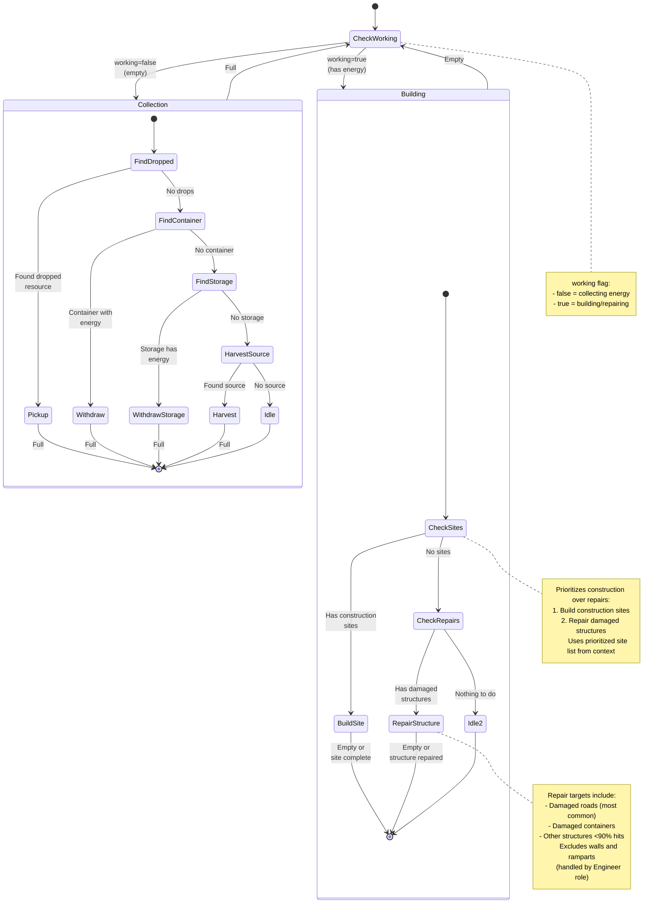

# Builder State Machine

**Role:** `builder`  
**Category:** Economy  
**Description:** Construction specialist focused on building structures and repairing damaged buildings

## Overview

Builder dedicates itself to construction and repair work. It alternates between collecting energy and building/repairing, prioritizing construction sites over repairs.

## State Machine Diagram

## State Transitions

### Working State

| From State | To State | Condition |
|------------|----------|-----------|
| undefined | false | Creep is empty |
| undefined | true | Creep has energy |
| false | true | Creep becomes full |
| true | false | Creep becomes empty |

### Collection Mode (working=false)

Uses standard energy finding pattern:

1. **Dropped Resources** - Pick up from ground
2. **Containers** - Withdraw from containers with energy
3. **Storage** - Withdraw from storage
4. **Sources** - Harvest directly (fallback)
5. **Idle** - No energy sources

### Building Mode (working=true)

Priority order:

1. **Construction Sites** - Build from prioritized list
2. **Repairs** - Repair damaged structures (roads, containers, etc.)
3. **Idle** - No work available (rare)

## Special Behaviors

### Construction Site Prioritization

Uses `prioritizedSites` from context which orders sites by:
- Spawn/Extension (highest priority)
- Tower
- Storage/Terminal
- Container
- Road
- Other structures

This ensures critical infrastructure is built first.

### Repair Targeting

Repairs non-defensive structures:
- **Roads** - Most common repair target
- **Containers** - Keep energy infrastructure working
- **Other structures** - General maintenance

Does NOT repair:
- Walls (no immediate impact)
- Ramparts (handled by Engineer role)

### Repair Threshold

Only repairs structures below ~90% hits to:
- Avoid wasting energy on minor damage
- Focus on structures that actually need repair
- Let natural decay stabilize before repairing

### Completion Detection

Building/repair states complete when:
- Creep energy reaches 0 (standard)
- Construction site is completed (can happen mid-action)
- Structure is fully repaired (can happen mid-action)

## Performance Notes

- **Cache Duration:** Uses standard economy caching
- **Target Selection:** Uses cached closest for repairs
- **Priority List:** Pre-filtered construction sites from context
- **Energy Efficiency:** Stops repairing when structure is full hits

## Body Composition

Balanced build and carry:
- **Early Game:** 2 WORK, 2 CARRY, 2 MOVE (400 energy)
- **Mid Game:** 4 WORK, 4 CARRY, 4 MOVE (800 energy)
- **Late Game:** 8 WORK, 8 CARRY, 8 MOVE (1600 energy)

Ratio: 1 WORK : 1 CARRY : 1 MOVE
- WORK for building/repair speed
- CARRY for energy capacity
- MOVE for reasonable speed (1.0 on plains)

## Scaling

Builder count scales with:
- Number of construction sites in room
- Amount of damaged infrastructure
- Room RCL (more sites at higher levels)
- Available spawn capacity

Typical: 1-2 builders per room in active construction, 0-1 for maintenance.

## Integration with Room Planning

Builders execute the room's construction plan:
- Blueprint system places construction sites
- Builders construct them in priority order
- Repairs maintain existing infrastructure
- Works in tandem with room planner

## Related Code

- Implementation: `/packages/screeps-bot/src/roles/behaviors/economy.ts` → `builder()`
- Entry Point: `/packages/screeps-bot/src/roles/economy/index.ts` → `runEconomyRole()`
- Site Prioritization: Computed in context creation
- Energy Finding: `/packages/screeps-bot/src/roles/behaviors/economy.ts` → `findEnergy()`
