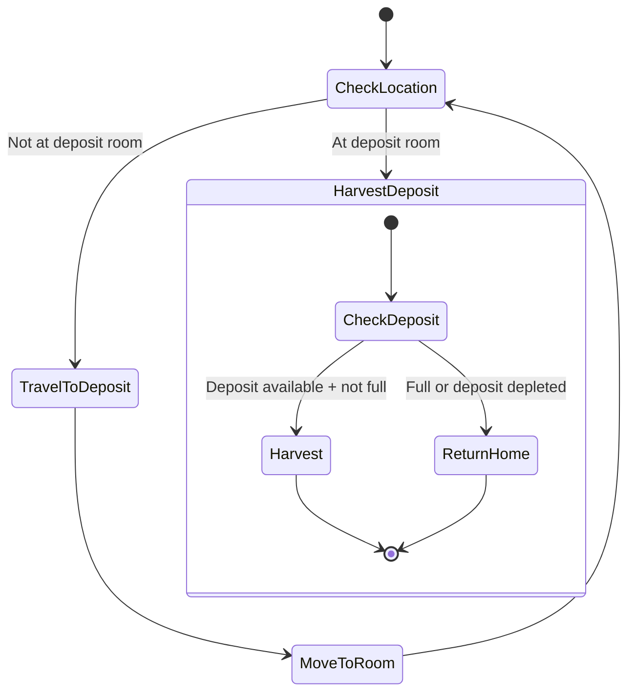

# DepositHarvester State Machine

**Role:** `depositHarvester`  
**Category:** Economy  
**Description:** Harvests from deposits in highway/SK rooms for rare resources

## State Machine Diagram

**Key Behaviors:**
- Targets deposits (highway/SK rooms)
- Harvests rare commodities
- Returns home when full or deposit on cooldown
- Risky (SK rooms have strongholds)
- Requires WORK parts for harvesting

**Body:** Balanced (5 WORK, 10 CARRY, 8 MOVE for speed)
