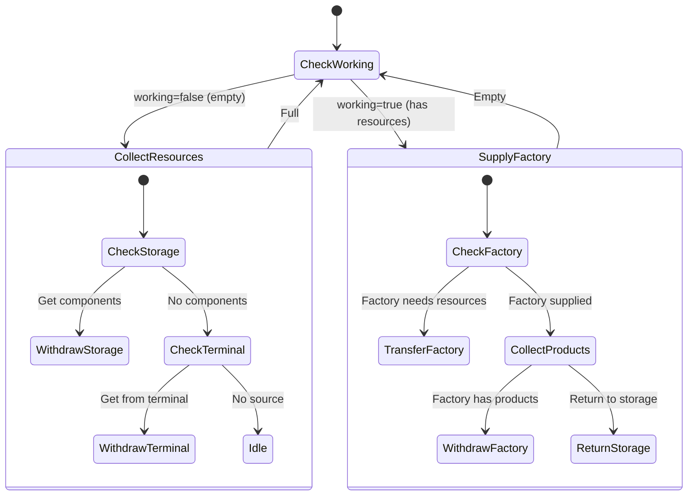

# FactoryWorker State Machine

**Role:** `factoryWorker`  
**Category:** Economy  
**Description:** Operates factory for commodity production

## State Machine Diagram

**Key Behaviors:**
- Supplies resources to factory
- Collects produced commodities
- Returns products to storage/terminal
- Enables factory commodity production
- Works with factory production planner

**Body:** Logistics focused (10 CARRY, 5 MOVE)
