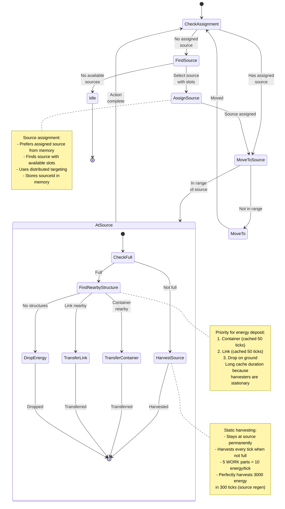

# Harvester State Machine

**Role:** `harvester`  
**Category:** Economy  
**Description:** Stationary miner that sits at a source and harvests continuously

## Overview

Harvester is a specialized role designed for efficient energy extraction. Unlike mobile roles, harvesters stay at their assigned source and transfer energy to nearby containers or links, allowing dedicated haulers to transport it.

## State Machine Diagram

## State Transitions

### Source Assignment

| State | Next State | Condition |
|-------|------------|-----------|
| No assignment | Find source | memory.sourceId is undefined |
| Has assignment | Move to source | memory.sourceId exists |
| At source | Harvest | In range and not full |
| At source | Transfer/Drop | Full and structure available |

### Harvesting Cycle

1. **Harvest** - Extract energy from source (continues until full)
2. **Transfer/Drop** - Deposit energy to nearby structure
3. **Repeat** - Continue cycle without moving

## Special Behaviors

### Static Mining Pattern

Harvesters follow the "static harvesting" best practice:
- One creep per source stays permanently at the source
- Dedicated haulers transport the energy
- More efficient than mobile "harvest + transport" pattern
- Optimal body: 5 WORK + 1 MOVE + small CARRY (for container-less start)

### Source Slot Assignment

Sources have limited adjacent tiles (typically 2-5 "slots"). The harvester:
- Finds sources with available slots
- Assigns itself to a specific sourceId
- Stores the assignment in memory.sourceId
- Uses distributed targeting to prevent multiple harvesters per source

### Nearby Structure Caching

Since harvesters are stationary, their nearby containers/links rarely change:
- Cache duration: 50 ticks
- Checks for container first (most common)
- Falls back to link (for higher RCL rooms)
- Drops energy if no structure available (emergency fallback)

### Energy Deposit Priority

1. **Container** - Primary target, cached for 50 ticks
2. **Link** - Secondary target for high-level rooms
3. **Drop** - Fallback when no structures built yet

## Performance Notes

- **Cache Duration:** 50 ticks for nearby structures (very long due to stationary nature)
- **Movement:** Minimal - only moves to assigned source once
- **CPU Efficiency:** Very high - simple harvest loop with minimal pathfinding
- **Distributed Assignment:** Prevents multiple harvesters on same source

## Body Composition

Optimal harvester body at different RCL:
- **RCL 1-2:** 2 WORK, 1 CARRY, 1 MOVE (200 energy)
- **RCL 3-4:** 5 WORK, 1 CARRY, 1 MOVE (550 energy) - Perfect for 3000 energy source
- **RCL 5+:** 5 WORK, 1 CARRY, 1 MOVE (550 energy) - Container ensures no drops

## Integration with Haulers

Harvesters work in tandem with haulers:
- **Harvester:** Extracts energy and fills container
- **Hauler:** Empties container and transports to storage/spawns
- This division of labor is more CPU and energy efficient than all-in-one creeps

## Related Code

- Implementation: `/packages/screeps-bot/src/roles/behaviors/economy.ts` → `harvester()`
- Entry Point: `/packages/screeps-bot/src/roles/economy/index.ts` → `runEconomyRole()`
- Source Assignment: `/packages/screeps-bot/src/roles/behaviors/economy.ts` → `assignSource()`
- Structure Caching: `/packages/screeps-bot/src/roles/behaviors/economy.ts` → `findNearbyContainerCached()`, `findNearbyLinkCached()`
