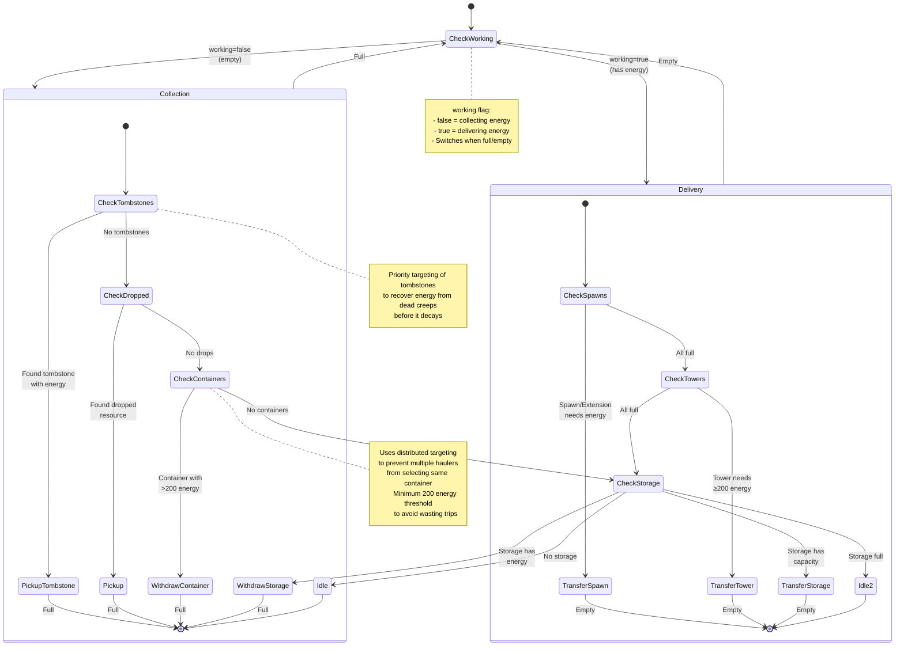

# Hauler State Machine

**Role:** `hauler`  
**Category:** Economy  
**Description:** Energy transport specialist that moves energy from containers to spawn structures and storage

## Overview

Hauler is optimized for transporting large amounts of energy efficiently. It picks up from containers/storage and delivers to spawn structures, towers, and storage, focusing purely on logistics without harvesting.

## State Machine Diagram

## State Transitions

### Working State

| From State | To State | Condition |
|------------|----------|-----------|
| undefined | false | Creep is empty |
| undefined | true | Creep has energy |
| false | true | Creep becomes full |
| true | false | Creep becomes empty |

### Collection Mode (working=false)

Priority order for finding energy:

1. **Tombstones** - Pick up from tombstones (recovers energy from dead creeps)
2. **Dropped Resources** - Pick up from ground (cached, 5 ticks)
3. **Containers** - Withdraw from containers with >200 energy (distributed, cached 10 ticks)
4. **Storage** - Withdraw from storage if no containers available
5. **Idle** - No energy sources available

### Delivery Mode (working=true)

Priority order for delivering energy:

1. **Spawn Structures** - Transfer to spawns/extensions with capacity (cached, 5 ticks)
2. **Towers** - Transfer to towers with ≥200 capacity (cached, 10 ticks)
3. **Storage** - Transfer to storage if it has capacity
4. **Idle** - All targets full (shouldn't happen often)

## Special Behaviors

### Distributed Container Targeting

Uses `findDistributedTarget()` for containers to prevent multiple haulers from:
- Selecting the same container
- Creating traffic jams at popular containers
- Inefficient energy distribution

### Container Energy Threshold

Only withdraws from containers with >200 energy to:
- Avoid wasting trips on small amounts
- Let containers accumulate energy from harvesters
- Maximize hauler efficiency (larger loads)

### Tombstone Priority

Tombstones are checked first because:
- Energy in tombstones decays quickly
- Recovers resources from dead creeps
- Prevents energy waste from creep deaths

### Storage Interaction

Storage serves dual purpose:
- **Source** when containers are empty (backup energy source)
- **Sink** when spawn structures are full (overflow storage)

This creates a balanced energy flow in the room.

## Performance Notes

- **Cache Duration:**
  - Spawn structures: 5 ticks
  - Towers: 10 ticks
  - Containers: 10 ticks
  - Dropped resources: 5 ticks
- **Distributed Targets:** Containers (prevents clustering)
- **Fresh Filtering:** Capacity checks done each tick
- **No Harvesting:** Pure transport role for maximum efficiency

## Body Composition

Optimal hauler body prioritizes CARRY and MOVE:
- **Early Game:** 2 CARRY, 2 MOVE (200 energy) - 100 capacity, 1.0 move speed
- **Mid Game:** 6 CARRY, 3 MOVE (450 energy) - 300 capacity, 1.0 move speed
- **Late Game:** 16 CARRY, 8 MOVE (1200 energy) - 800 capacity, 1.0 move speed
- **Max:** 25 CARRY, 25 MOVE (2500 energy) - 1250 capacity, 1.0 move speed on roads

Key principle: 2 CARRY per 1 MOVE for full speed on plains, more efficient on roads.

## Scaling

Hauler count scales with:
- Number of harvesters/sources
- Distance from sources to spawn/storage
- Room energy throughput requirements
- Available spawn capacity

Typical ratio: 1 hauler per harvester, more if sources are distant.

## Integration with Economy

Haulers are the "circulatory system" of the room economy:
- Harvesters extract energy (producers)
- Haulers transport energy (distributors)
- Other roles consume energy (consumers)
- Storage acts as buffer/bank

This specialization is more efficient than generalist creeps.

## Related Code

- Implementation: `/packages/screeps-bot/src/roles/behaviors/economy.ts` → `hauler()`
- Entry Point: `/packages/screeps-bot/src/roles/economy/index.ts` → `runEconomyRole()`
- Distributed Targeting: `/packages/screeps-bot/src/utils/targetDistribution.ts`
- State Machine: `/packages/screeps-bot/src/roles/behaviors/stateMachine.ts`
