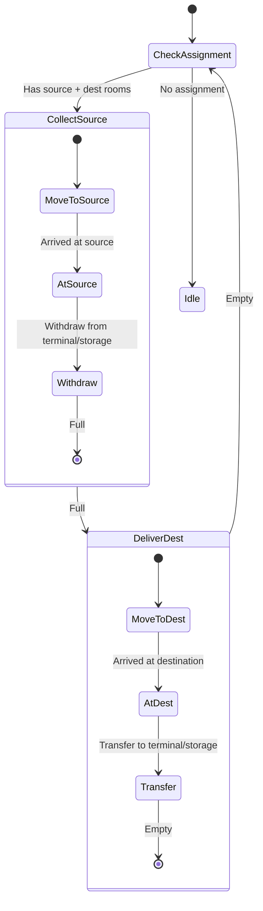

# InterRoomCarrier State Machine

**Role:** `interRoomCarrier`  
**Category:** Economy  
**Description:** Transfers resources between rooms via terminals

## State Machine Diagram

**Key Behaviors:**
- Assigned source and destination rooms
- Transfers specific resources between rooms
- Larger capacity than terminal transfers (no energy cost)
- Used for bulk inter-room logistics
- Slower than terminal but more energy efficient for large amounts

**Body:** Maximum capacity (25 CARRY, 25 MOVE on roads)
