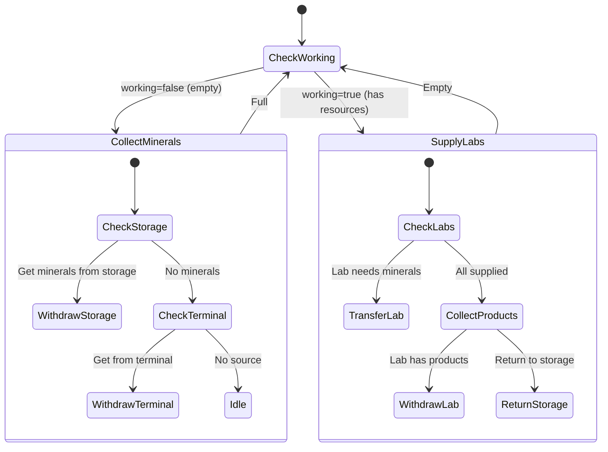

# LabTech State Machine

**Role:** `labTech`  
**Category:** Economy  
**Description:** Manages lab reactions and mineral logistics

## State Machine Diagram

**Key Behaviors:**
- Supplies reactant minerals to input labs
- Collects reaction products from output labs
- Returns products to storage/terminal
- Enables lab-based mineral production
- Coordinates with lab reaction planner

**Body:** Pure logistics (10 CARRY, 5 MOVE)
