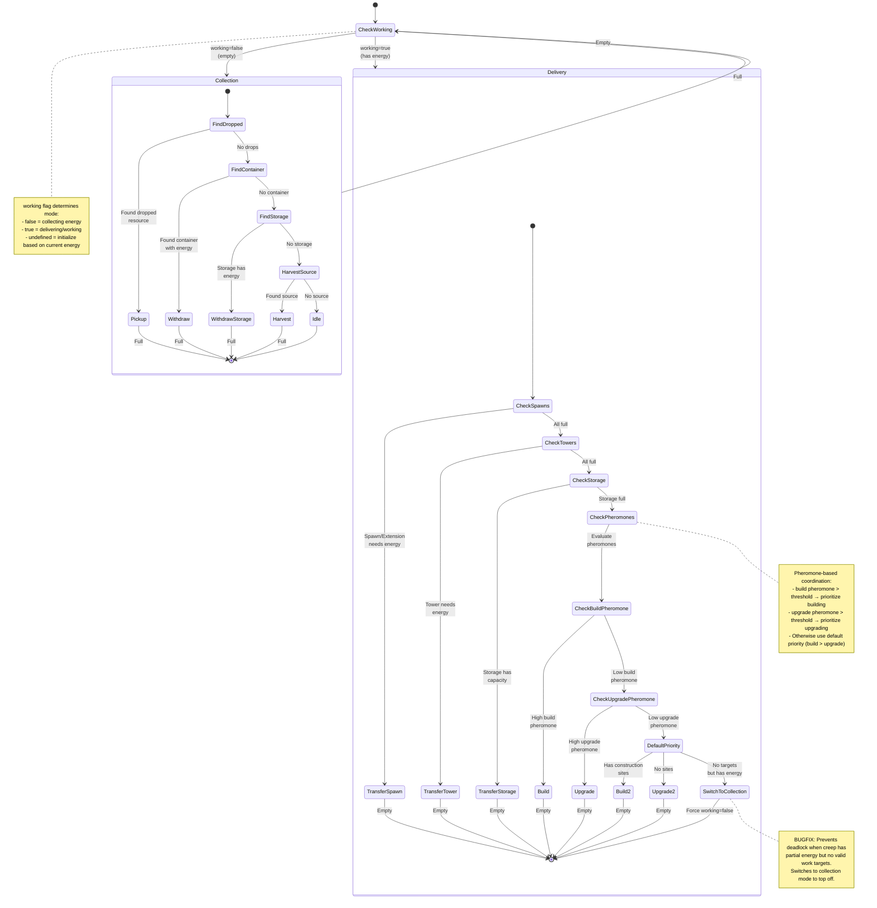

# LarvaWorker State Machine

**Role:** `larvaWorker`  
**Category:** Economy  
**Description:** General purpose starter creep that handles all basic tasks

## Overview

LarvaWorker is a versatile role that transitions between collecting energy and performing various work tasks. It prioritizes delivering energy to spawn structures, then hauling to storage, then building, and finally upgrading the controller.

## State Machine Diagram

## State Transitions

### Working State

| From State | To State | Condition |
|------------|----------|-----------|
| undefined | false | Creep is empty |
| undefined | true | Creep has energy |
| false | true | Creep becomes full |
| true | false | Creep becomes empty |
| true | false | No valid targets (force switch) |

### Collection Mode (working=false)

Priority order for finding energy:

1. **Dropped Resources** - Pick up from ground (cached, 5 ticks)
2. **Containers** - Withdraw from containers with >100 energy (distributed targeting)
3. **Storage** - Withdraw from storage if available
4. **Sources** - Harvest directly from source (distributed targeting)
5. **Idle** - No energy sources available

### Delivery Mode (working=true)

Priority order for spending energy:

1. **Spawn Structures** - Transfer to spawns/extensions with capacity (cached, 5 ticks)
2. **Towers** - Transfer to towers with ≥200 capacity (cached, 10 ticks)
3. **Storage** - Transfer to storage if it has capacity
4. **Building** (pheromone-influenced) - Build if build pheromone is high
5. **Upgrading** (pheromone-influenced) - Upgrade if upgrade pheromone is high
6. **Building** (default) - Build if construction sites exist
7. **Upgrading** (default) - Upgrade controller
8. **Switch to Collection** - If no targets found but creep has energy (deadlock prevention)

## Special Behaviors

### Distributed Targeting

Uses `findDistributedTarget()` for containers and sources to prevent multiple creeps from selecting the same target and causing traffic jams.

### Pheromone Integration

Reads room pheromones to coordinate with other creeps:
- High `build` pheromone → prioritize construction
- High `upgrade` pheromone → prioritize controller upgrading

### Deadlock Prevention

If creep has energy but no valid delivery targets, it switches to collection mode to top off capacity instead of idling. This prevents the "partial energy deadlock" where creeps get stuck in working=true state with nowhere to deliver.

## Performance Notes

- **Cache Duration:** 
  - Spawn structures: 5 ticks
  - Towers: 10 ticks
  - Dropped resources: 5 ticks
- **Distributed Targets:** Containers, Sources (prevents clustering)
- **Fresh Filtering:** Capacity checks done each tick for accurate targeting

## Related Code

- Implementation: `/packages/screeps-bot/src/roles/behaviors/economy.ts` → `larvaWorker()`
- Entry Point: `/packages/screeps-bot/src/roles/economy/index.ts` → `runEconomyRole()`
- State Machine: `/packages/screeps-bot/src/roles/behaviors/stateMachine.ts` → `evaluateWithStateMachine()`
