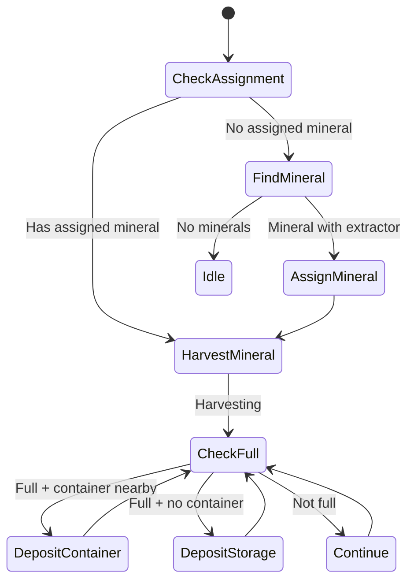

# MineralHarvester State Machine

**Role:** `mineralHarvester`  
**Category:** Economy  
**Description:** Extracts minerals from extractors for labs and market

## State Machine Diagram

**Key Behaviors:**
- Only spawned when extractor exists
- Stays at assigned mineral like harvesters
- Deposits in container or storage
- Works with mineralCarrier for transport
- Stops when mineral depletes (regenerates slowly)

**Body:** Similar to harvester (5 WORK, 1 CARRY, 1 MOVE)
