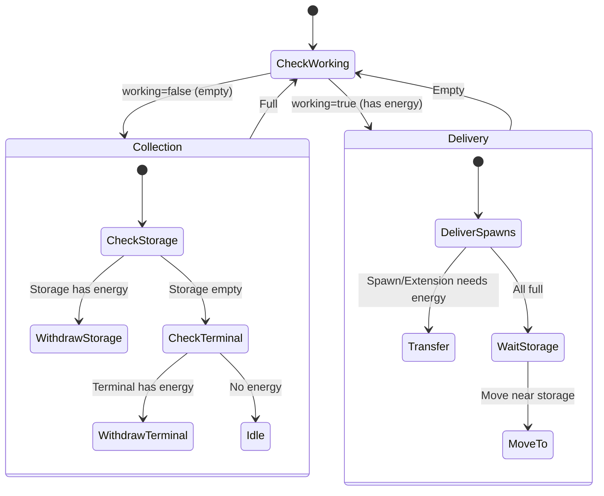

# QueenCarrier State Machine

**Role:** `queenCarrier`  
**Category:** Economy  
**Description:** High-priority distributor that keeps spawns and extensions filled from storage

## State Machine Diagram

**Key Behaviors:**
- Specialized for spawn/extension refilling only
- Only sources energy from storage/terminal (no containers/sources)
- Waits near storage when spawns are full (instant response)
- Highest priority for spawn energy (faster spawning)
- Minimal travel time maximizes efficiency

**Body:** Heavy CARRY focus (e.g., 16 CARRY, 8 MOVE)
