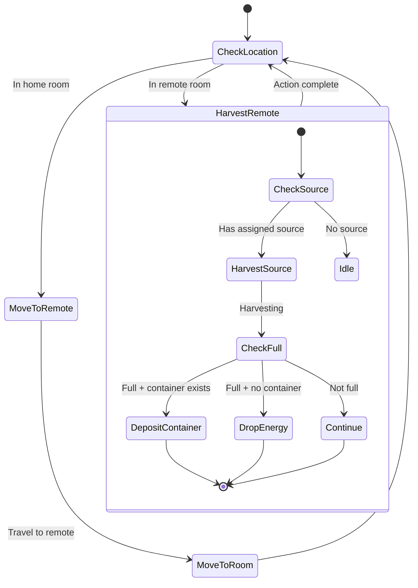

# RemoteHarvester State Machine

**Role:** `remoteHarvester`  
**Category:** Economy  
**Description:** Mines sources in remote (non-owned) rooms

## State Machine Diagram

**Key Behaviors:**
- Assigned to specific remote room (memory.targetRoom)
- Travels to remote room
- Harvests from assigned source
- Deposits in container built by remoteWorker
- Works with remoteHauler for energy transport
- Vulnerable to attacks (no military escort in early game)

**Body:** Same as harvester (5 WORK, 1 CARRY, 1 MOVE)
