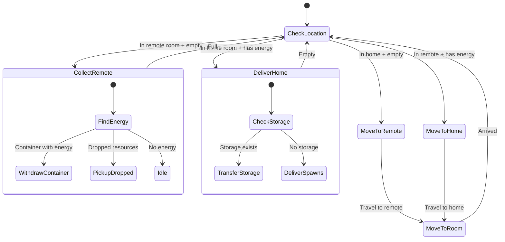

# RemoteHauler State Machine

**Role:** `remoteHauler`  
**Category:** Economy  
**Description:** Transports energy from remote rooms back to home storage

## State Machine Diagram

**Key Behaviors:**
- Assigned to specific remote room (memory.targetRoom)
- Collects energy in remote room (container/drops)
- Returns to home room to deliver
- Continuous cycle between rooms
- Long travel paths (energy efficient body needed)

**Body:** Heavy CARRY with MOVE for roads (12 CARRY, 6 MOVE)
