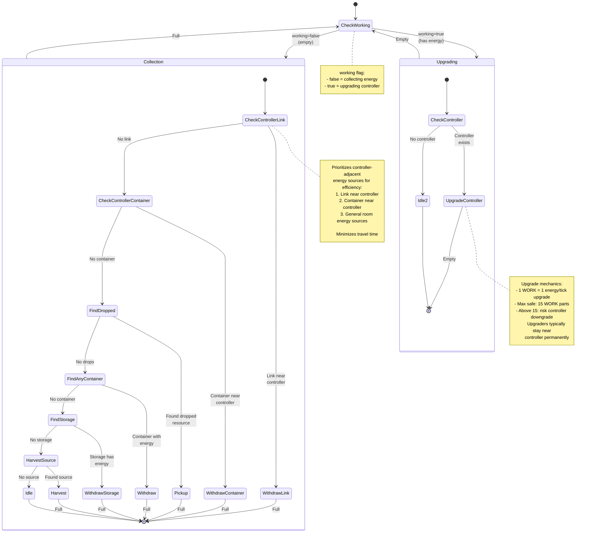

# Upgrader State Machine

**Role:** `upgrader`  
**Category:** Economy  
**Description:** Controller upgrade specialist that maximizes RCL progression

## Overview

Upgrader is dedicated to upgrading the room controller. It continuously cycles between collecting energy and upgrading, optionally using a link or container near the controller for efficient energy supply.

## State Machine Diagram

## State Transitions

### Working State

| From State | To State | Condition |
|------------|----------|-----------|
| undefined | false | Creep is empty |
| undefined | true | Creep has energy |
| false | true | Creep becomes full |
| true | false | Creep becomes empty |

### Collection Mode (working=false)

Priority order optimized for controller proximity:

1. **Controller Link** - Link within range 2 of controller (highest priority)
2. **Controller Container** - Container within range 3 of controller
3. **Dropped Resources** - General room drops
4. **Any Containers** - Other containers in room
5. **Storage** - Room storage
6. **Sources** - Direct harvesting (fallback)
7. **Idle** - No energy sources

### Upgrading Mode (working=true)

Simple single-purpose action:

1. **Upgrade Controller** - Continuously upgrade until empty
2. **Idle** - Only if no controller (should never happen)

## Special Behaviors

### Controller-Adjacent Energy Sources

The upgrader prioritizes energy sources near the controller:
- **Link at controller** - Most efficient, instant energy delivery
- **Container at controller** - Common setup, haulers keep it filled
- Both minimize travel time for the upgrader

### Link-Upgrader Setup

High-level rooms often have:
- Link at controller (filled by source links or storage)
- 1-2 upgraders permanently stationed at controller
- Very efficient: upgraders never move, just withdraw and upgrade

### Container-Upgrader Setup

Mid-level rooms typically have:
- Container adjacent to controller
- Haulers deposit energy into container
- Upgraders withdraw from container and upgrade

### Stationary Pattern

Once at controller, upgraders typically stay there:
- Energy sources near controller (link/container)
- No need to move elsewhere
- Maximizes upgrade throughput

### Controller Downgrade Prevention

Rooms must maintain minimum upgrade rate to prevent downgrade:
- RCL 1-7: No downgrade risk
- RCL 8: Must upgrade or controller downgrades after 200,000 ticks

Upgraders ensure continuous progress.

## Performance Notes

- **Movement:** Minimal after reaching controller
- **Energy Efficiency:** Direct path from nearby source to controller
- **CPU Efficiency:** Simple upgrade loop
- **Throughput:** Limited by WORK parts and energy supply

## Body Composition

Optimized for upgrade work:
- **Early Game:** 3 WORK, 2 CARRY, 2 MOVE (550 energy)
- **Mid Game:** 8 WORK, 4 CARRY, 6 MOVE (1400 energy)
- **Late Game:** 15 WORK, 8 CARRY, 11 MOVE (2550 energy) - Max safe WORK
- **RCL 8 Downgrade Prevention:** 1 WORK, 1 CARRY, 1 MOVE (200 energy) - Minimal

Key principle: Maximize WORK parts (up to 15 for safety), add CARRY for capacity, add MOVE for reasonable speed.

## Scaling

Upgrader count varies by room stage:

| Stage | Upgraders | Goal |
|-------|-----------|------|
| Early RCL 1-3 | 2-3 | Fast progression |
| Mid RCL 4-6 | 3-5 | Steady growth |
| Late RCL 7 | 5-10 | Push to RCL 8 |
| RCL 8 Stable | 1-2 | Prevent downgrade |
| RCL 8 GCL Push | 5-15 | Maximize GCL gain |

Energy availability and CPU budget determine actual count.

## GCL Progression

At RCL 8, upgraders contribute to GCL (Global Control Level):
- Each upgrade point adds to GCL progress
- More GCL = can control more rooms
- Upgraders become GCL farming units

## Controller Reservation

In remote rooms, upgraders work with reservers:
- Reserver reserves controller (increases energy capacity)
- Upgraders keep reservation active
- Prevents controller from decaying

## Related Code

- Implementation: `/packages/screeps-bot/src/roles/behaviors/economy.ts` → `upgrader()`
- Entry Point: `/packages/screeps-bot/src/roles/economy/index.ts` → `runEconomyRole()`
- Energy Finding: `/packages/screeps-bot/src/roles/behaviors/economy.ts` → `findEnergy()`
- Link/Container Finding: Done in behavior function
