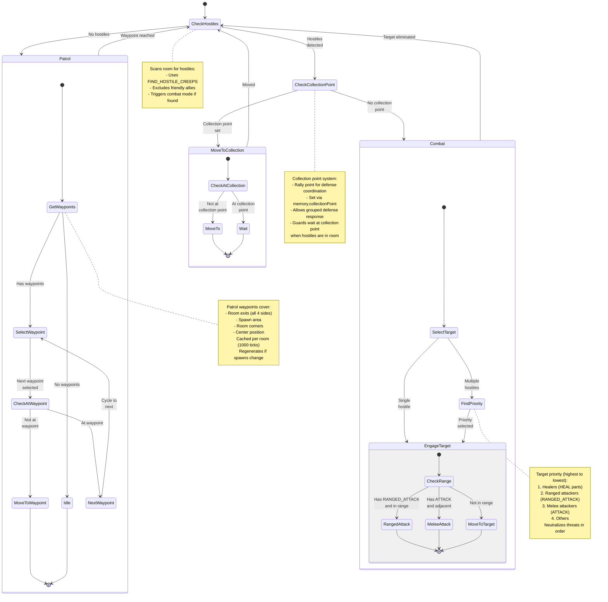

# Guard State Machine

**Role:** `guard`  
**Category:** Military  
**Description:** Room defender that patrols and engages hostiles

## Overview

Guard is a defensive role that patrols the room looking for threats. When hostiles are detected, it engages them with ranged or melee attacks. Guards also coordinate with healers and respond to collection points during attacks.

## State Machine Diagram

## State Transitions

### Threat Detection

| State | Next State | Condition |
|-------|------------|-----------|
| No hostiles | Patrol | Room is clear |
| Hostiles detected | Check collection | Enemies in room |
| Collection point set | Move to collection | Coordinate defense |
| No collection point | Combat | Engage immediately |

### Combat Engagement

1. **Select Target** - Find priority target
2. **Check Range** - Determine attack type
3. **Attack/Move** - Engage or close distance
4. **Repeat** - Continue until target eliminated

### Patrol Pattern

1. **Get Waypoints** - Load cached patrol route
2. **Select Waypoint** - Choose next patrol point
3. **Move to Waypoint** - Travel to position
4. **Next Waypoint** - Cycle to next point
5. **Repeat** - Continuous patrol loop

## Special Behaviors

### Priority Target Selection

Guards use intelligent target prioritization:

| Priority | Target Type | Reason |
|----------|-------------|--------|
| 1 | Healers | Disable enemy healing first |
| 2 | Ranged | High damage, hard to approach |
| 3 | Melee | Moderate threat |
| 4 | Others | Non-combat units |

This ensures the most dangerous enemies are eliminated first.

### Collection Point System

When hostiles attack:
- Room sets `memory.collectionPoint` via rally point manager
- All guards move to collection point
- Allows coordinated group defense
- Guards wait until hostiles are engaged or point is cleared

Benefits:
- Prevents guards from being picked off individually
- Creates defensive strongpoint
- Coordinates with healers and towers

### Patrol Waypoint Coverage

Patrol waypoints provide comprehensive room coverage:
- **Exit Points** - All 4 sides (top, bottom, left, right)
  - 3 waypoints per side (corners and center)
- **Spawn Area** - Near spawns (2 points per spawn)
- **Room Corners** - 4 corner positions
- **Center** - Room center (25, 25)

This ensures guards encounter threats quickly.

### Waypoint Caching

Waypoints are expensive to generate (terrain checks), so they're cached:
- **Cache Duration:** 1000 ticks
- **Invalidation:** When spawn count changes
- **Per Room:** Each room has its own cached waypoints

### Attack Type Selection

Guards adapt based on body composition:
- **Has RANGED_ATTACK** - Use ranged attack (range 3)
- **Has ATTACK** - Use melee attack (range 1)
- **Both** - Prefer ranged until adjacent, then melee
- **Movement** - Close distance if not in attack range

## Performance Notes

- **Waypoint Cache:** 1000 tick duration reduces CPU
- **Target Priority:** Fast priority sorting
- **Collection Point:** Reduces unnecessary movement
- **Attack Selection:** Body-aware combat logic

## Body Composition

Guards vary by defense strategy:

**Melee Guard:**
- Pattern: TOUGH, ATTACK, MOVE
- Example: 10 TOUGH, 10 ATTACK, 10 MOVE (1000 energy)
- Best against: Melee attackers, structure damage

**Ranged Guard:**
- Pattern: TOUGH, RANGED_ATTACK, MOVE
- Example: 5 TOUGH, 10 RANGED_ATTACK, 10 MOVE (1250 energy)
- Best against: Ranged units, general defense

**Mixed Guard:**
- Pattern: TOUGH, RANGED_ATTACK, ATTACK, MOVE
- Example: 5 TOUGH, 5 RANGED_ATTACK, 5 ATTACK, 10 MOVE (1250 energy)
- Best against: Flexible response

Key: TOUGH parts absorb damage, combat parts deal damage, MOVE parts maintain speed.

## Integration with Defense System

Guards work with other defense components:
- **Towers** - Provide ranged support
- **Healers** - Keep guards alive
- **Ramparts** - Provide cover
- **Safe Mode** - Emergency protection
- **Collection Points** - Coordinate positioning

## Related Code

- Implementation: `/packages/screeps-bot/src/roles/behaviors/military.ts` → `guard()`
- Entry Point: `/packages/screeps-bot/src/roles/military/index.ts` → `runMilitaryRole()`
- Target Priority: `/packages/screeps-bot/src/roles/behaviors/military.ts` → `findPriorityTarget()`
- Patrol Waypoints: `/packages/screeps-bot/src/roles/behaviors/military.ts` → `getPatrolWaypoints()`
- Collection Points: `/packages/screeps-bot/src/utils/collectionPoint.ts`
