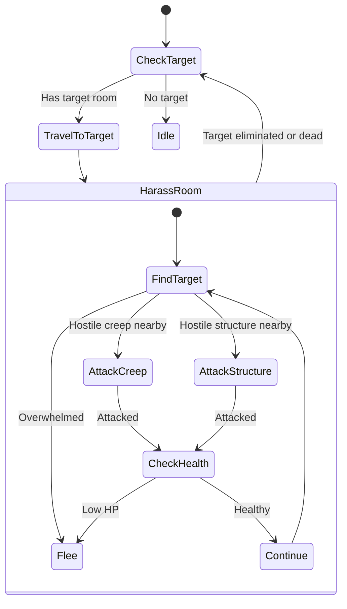

# Harasser State Machine

**Role:** `harasser`  
**Category:** Military  
**Description:** Fast, cheap disruptor for early-game aggression

## State Machine Diagram

**Key Behaviors:**
- Cheap, fast units for disruption
- Attacks economy creeps (harvesters, haulers)
- Attacks weak structures (extensions, containers)
- Flees when damaged
- Hit-and-run tactics
- Minimal investment, maximum disruption

**Body:** 2 ATTACK, 2 MOVE (260 energy) - Very cheap
