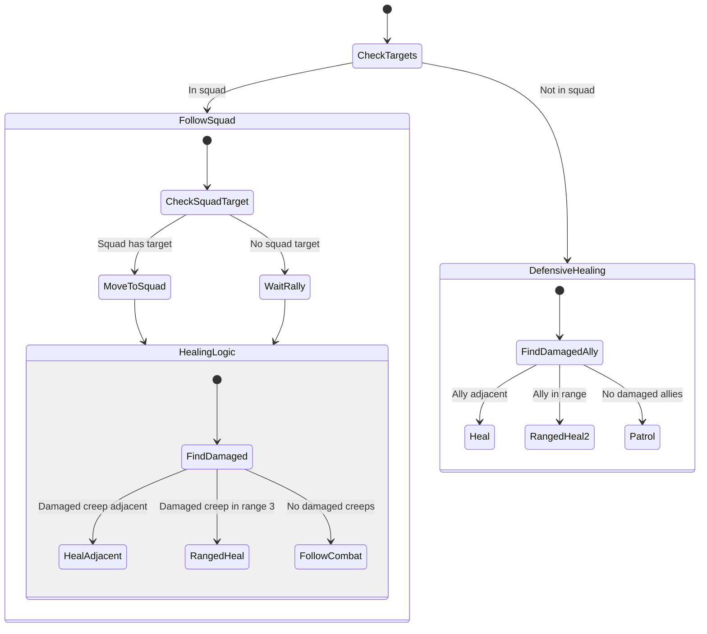

# Healer State Machine

**Role:** `healer`  
**Category:** Military  
**Description:** Provides healing support to friendly military units

## State Machine Diagram

**Key Behaviors:**
- Prioritizes healing damaged friendly creeps
- Uses heal() for adjacent (12 HP)
- Uses rangedHeal() for range 3 (4 HP)
- Follows squad members in offensive operations
- Patrols when no healing needed
- Essential for sustained combat

**Body:** HEAL and MOVE focused (10 HEAL, 10 MOVE)
