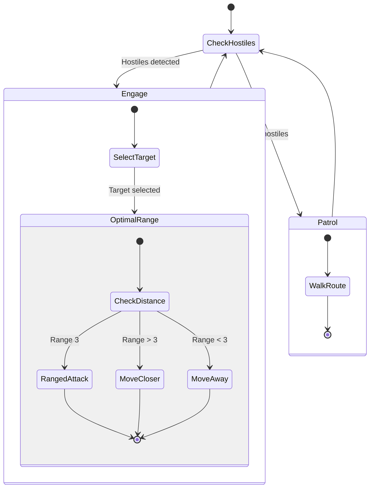

# Ranger State Machine

**Role:** `ranger`  
**Category:** Military  
**Description:** Ranged combat specialist for flexible engagement

## State Machine Diagram

**Key Behaviors:**
- Maintains optimal range 3 for ranged attacks
- Kites melee attackers (stays at range)
- Flexible positioning
- Works independently or in squads
- Mass attack for area damage if multiple enemies

**Body:** 15 RANGED_ATTACK, 5 MOVE (boosted for serious combat)
