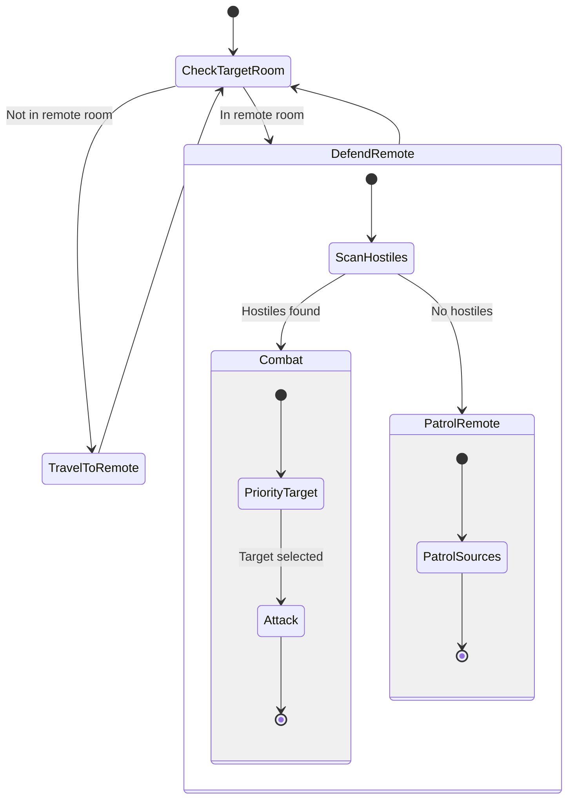

# RemoteGuard State Machine

**Role:** `remoteGuard`  
**Category:** Military  
**Description:** Defends remote mining operations

## State Machine Diagram

**Key Behaviors:**
- Assigned to specific remote room
- Protects remoteHarvesters and remoteHaulers
- Patrols between sources
- Engages invaders and hostile players
- Essential for secure remote mining

**Body:** Similar to guard (5 TOUGH, 10 RANGED_ATTACK, 10 MOVE)
