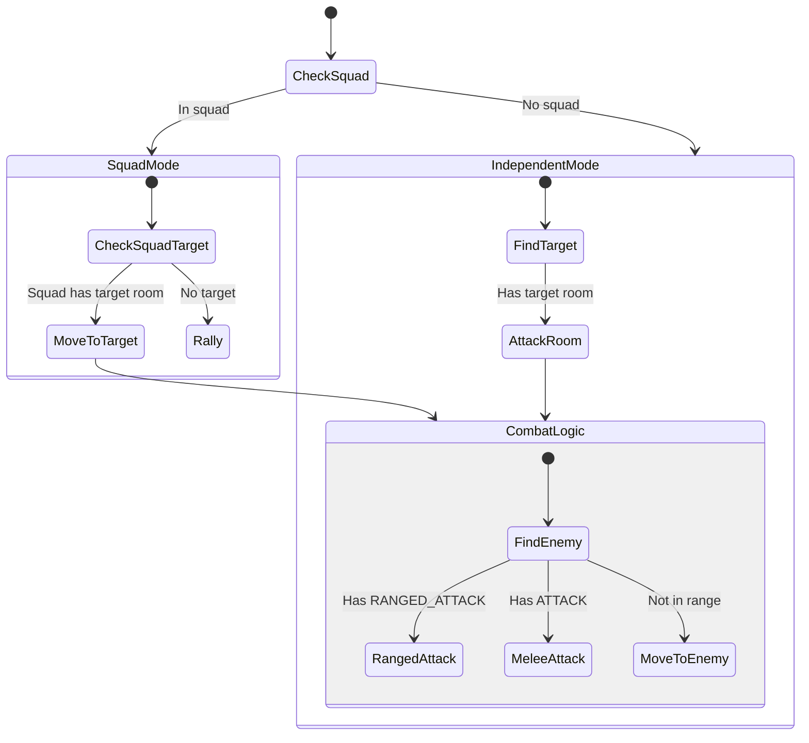

# Soldier State Machine

**Role:** `soldier`  
**Category:** Military  
**Description:** Offensive combat unit for attacking enemy rooms

## State Machine Diagram

**Key Behaviors:**
- Works in squads for coordinated attacks
- Attacks hostile creeps and structures
- Uses ranged or melee based on body
- Follows squad leader to target rooms
- Can operate independently if not in squad

**Body (Ranged):** 10 RANGED_ATTACK, 5 TOUGH, 10 MOVE
**Body (Melee):** 10 ATTACK, 5 TOUGH, 10 MOVE
