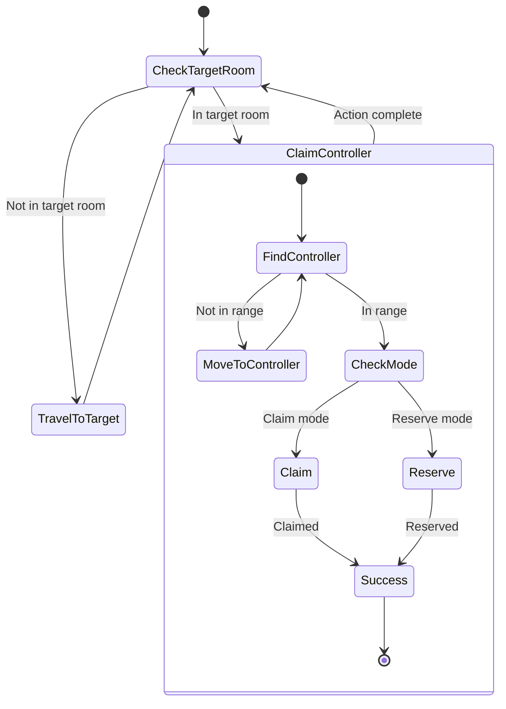

# Claimer State Machine

**Role:** `claimer`  
**Category:** Utility  
**Description:** Claims or reserves controllers for room expansion

## State Machine Diagram

**Key Behaviors:**
- Assigned to specific target room
- Two modes:
  - **Claim:** Takes ownership (requires GCL)
  - **Reserve:** Reserves for remote mining
- Claims/reserves then dies (single-use)
- Reservation increases source energy capacity
- Critical for expansion strategy

**Body (Claim):** 1 CLAIM, 1 MOVE (650 energy)
**Body (Reserve):** 2 CLAIM, 1 MOVE (1300 energy for max reservation)
