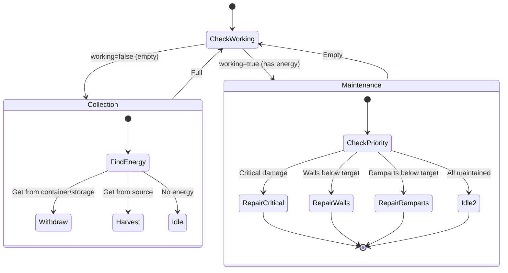

# Engineer State Machine

**Role:** `engineer`  
**Category:** Utility  
**Description:** Maintains walls, ramparts, and critical infrastructure

## State Machine Diagram

**Key Behaviors:**
- Specializes in defensive structure maintenance
- Repair priority:
  1. Critical structures (roads, containers)
  2. Walls (based on danger level)
  3. Ramparts (based on danger level)
- Dynamic repair targets based on threat
- Scales wall/rampart hits with room danger level
- Essential for long-term defense

**Body:** WORK focused (10 WORK, 5 CARRY, 10 MOVE)
