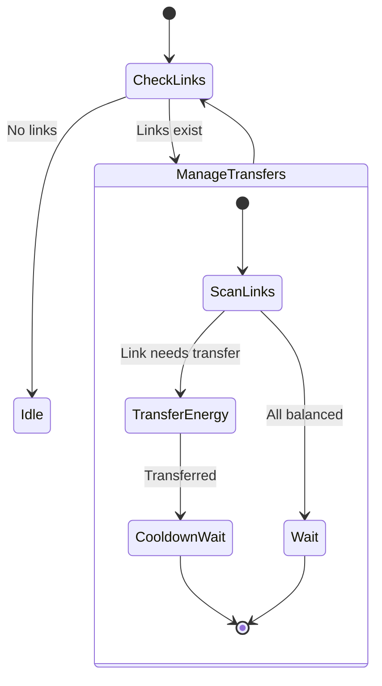

# LinkManager State Machine

**Role:** `linkManager`  
**Category:** Utility  
**Description:** Manages energy transfer via link network (if not automated)

## State Machine Diagram

**Key Behaviors:**
- Manages link network if not automated
- Transfers energy from source links to storage/controller links
- Monitors link cooldowns
- Balances energy distribution
- **Note:** Most bots automate links via StructureLink.transferEnergy()

**Body:** Pure movement (1 MOVE) - Minimal since links do the work
