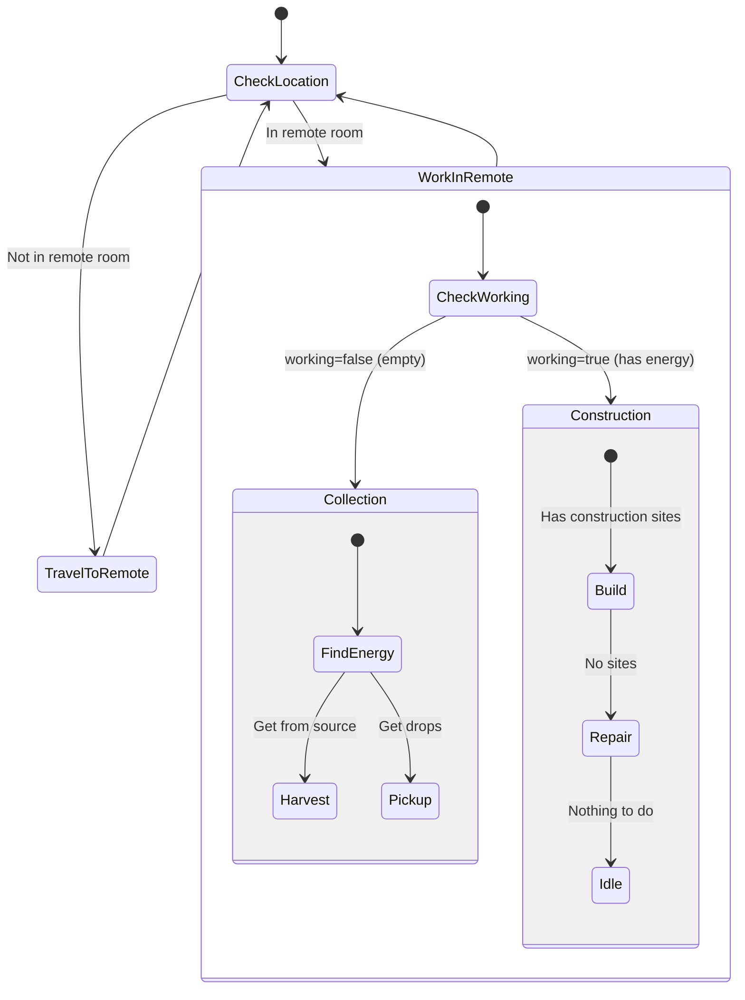

# RemoteWorker State Machine

**Role:** `remoteWorker`  
**Category:** Utility  
**Description:** Builds and maintains infrastructure in remote rooms

## State Machine Diagram

**Key Behaviors:**
- Assigned to specific remote room
- Builds containers at sources
- Builds roads from sources to home room
- Repairs damaged infrastructure
- Self-sufficient (harvests in remote room)
- Works independently

**Body:** Balanced (5 WORK, 5 CARRY, 5 MOVE)
