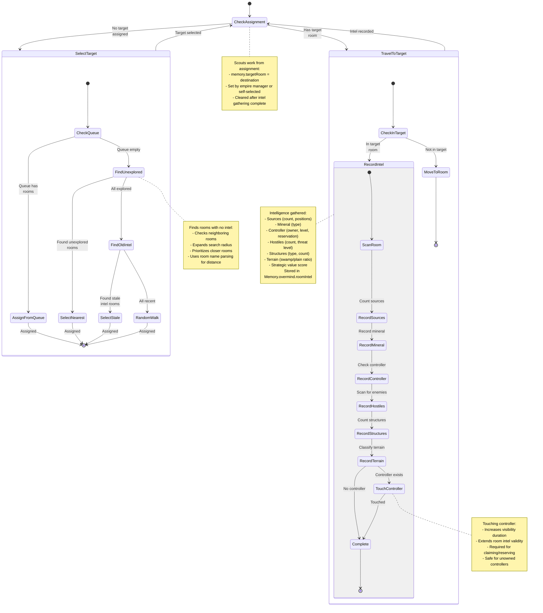

# Scout State Machine

**Role:** `scout`  
**Category:** Utility  
**Description:** Room exploration and intelligence gathering

## Overview

Scout explores unknown rooms, gathers intelligence about resources, threats, and strategic value. It records findings in memory for use by the empire manager and other systems.

## State Machine Diagram

## State Transitions

### Target Selection

| Condition | Action | Priority |
|-----------|--------|----------|
| Queue has rooms | Assign from queue | 1 (highest) |
| Has unexplored rooms | Select nearest unexplored | 2 |
| Has stale intel | Re-scout old rooms | 3 |
| All rooms recent | Random walk | 4 (fallback) |

### Intelligence Gathering

1. **Enter Target Room** - Move to assigned room
2. **Scan Room** - Gather all intelligence
3. **Record Intel** - Store in memory
4. **Touch Controller** - Extend visibility if safe
5. **Complete** - Clear assignment, select new target

## Special Behaviors

### Intelligence Recording

Scouts gather comprehensive room data:

**Resource Information:**
- Source count and positions
- Mineral type and position
- Deposit locations (if any)

**Ownership Information:**
- Controller owner (if claimed)
- Controller level
- Reservation status and owner
- Safe Mode status

**Threat Assessment:**
- Hostile creep count
- Hostile structure count
- Threat level (0-3)
- Hostile player identification

**Terrain Classification:**
- Swamp tile percentage
- Plain tile percentage
- Wall density
- Strategic chokepoints

**Strategic Value:**
- Overall room score
- Expansion suitability
- Remote mining potential
- Defensibility rating

### Intel Caching

Recorded intel includes:
- **lastSeen** - Game tick of last scout visit
- **validUntil** - When intel should be refreshed
- **Strategic value** - For expansion planning

Intel is refreshed when:
- Older than 1000 ticks (stale)
- Never scouted (undefined)
- Requested by empire manager

### Controller Touching

Scouts touch unowned controllers to:
- Increase room visibility duration
- Maintain awareness of neutral rooms
- Enable future claiming/reserving
- Low risk (no ownership commitment)

Does NOT touch controllers that are:
- Owned by hostile players
- In rooms with high threat level
- Under active Safe Mode

### Exploration Strategy

Scouts use expanding radius search:

1. **Check neighbors** - Rooms adjacent to owned rooms
2. **Expand radius** - Move to 2-3 room distance
3. **Random exploration** - Walk randomly when all known
4. **Revisit stale** - Re-scout rooms with old intel

This balances nearby intel (important) with broad exploration (strategic).

### Queue System

Empire manager can queue rooms for scouting:
- High-priority exploration targets
- Specific strategic rooms
- Response to remote mining needs
- Pre-expansion scouting

Scouts prioritize queued rooms over self-selected targets.

## Performance Notes

- **Intel Update:** Only full scan every 1000+ ticks
- **Partial Updates:** Dynamic data (hostiles) updated on revisit
- **Memory Efficient:** Compact intel storage format
- **CPU Light:** Minimal computation, mostly room.find() calls

## Body Composition

Scouts are cheap and fast:
- **Minimal:** 1 MOVE (50 energy) - Fastest, cheapest
- **Standard:** 2 MOVE (100 energy) - Same speed, more HP
- **Resilient:** 1 TOUGH, 2 MOVE (130 energy) - Survives damage

Key principle: MOVE only, no combat or work parts needed. Speed and cost efficiency are priorities.

## Scaling

Scout count varies by empire size:

| Empire Stage | Scouts | Purpose |
|--------------|--------|---------|
| Early (1-2 rooms) | 1 | Local exploration |
| Mid (3-5 rooms) | 2-3 | Expansion scouting |
| Late (6+ rooms) | 3-5 | Continuous intel |
| Multi-shard | 1 per shard | Per-shard awareness |

More scouts = fresher intel, but diminishing returns.

## Integration with Empire

Scouts feed critical data to:
- **Empire Manager** - Expansion decisions
- **Remote Mining** - Source location and safety
- **Military** - Threat detection and war targets
- **Claim Queue** - Pre-verified claim targets
- **Portal Network** - Inter-shard pathfinding

Without scouts, the empire is "blind" to opportunities and threats.

## Strategic Intelligence

Scout data enables:
- **Expansion Planning** - Find best rooms to claim
- **Remote Mining** - Identify safe, profitable sources
- **Threat Detection** - Early warning of hostile players
- **Alliance Coordination** - Share intel with allies
- **War Planning** - Assess enemy strength before attacks

## Related Code

- Implementation: `/packages/screeps-bot/src/roles/behaviors/utility.ts` → `scout()`
- Entry Point: `/packages/screeps-bot/src/roles/utility/index.ts` → `runUtilityRole()`
- Intel Recording: `/packages/screeps-bot/src/roles/behaviors/utility.ts` → `recordRoomIntel()`
- Overmind Memory: `/packages/screeps-bot/src/roles/behaviors/utility.ts` → `getOvermind()`
