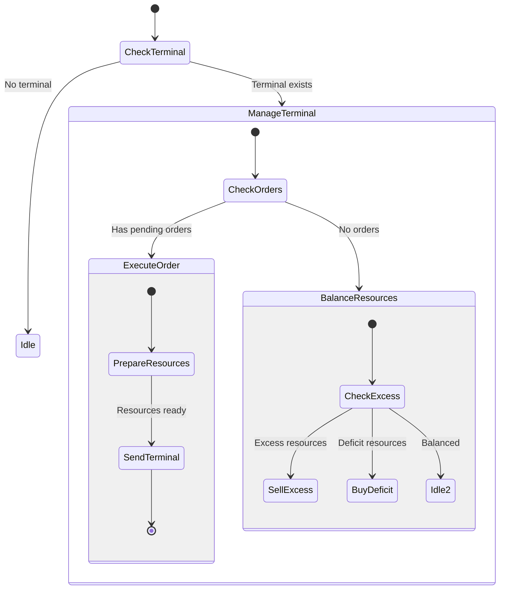

# TerminalManager State Machine

**Role:** `terminalManager`  
**Category:** Utility  
**Description:** Manages terminal market operations and inter-room transfers

## State Machine Diagram

**Key Behaviors:**
- Manages terminal operations
- Executes market orders
- Balances resource levels across rooms
- Sends inter-room transfers
- Monitors market prices
- **Note:** Often automated via terminal logic, not always a creep role

**Body:** Logistics (10 CARRY, 5 MOVE) if needed for manual transfers
